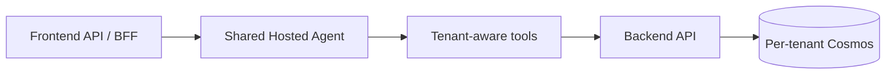
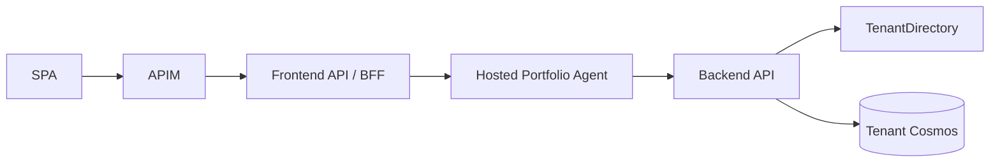
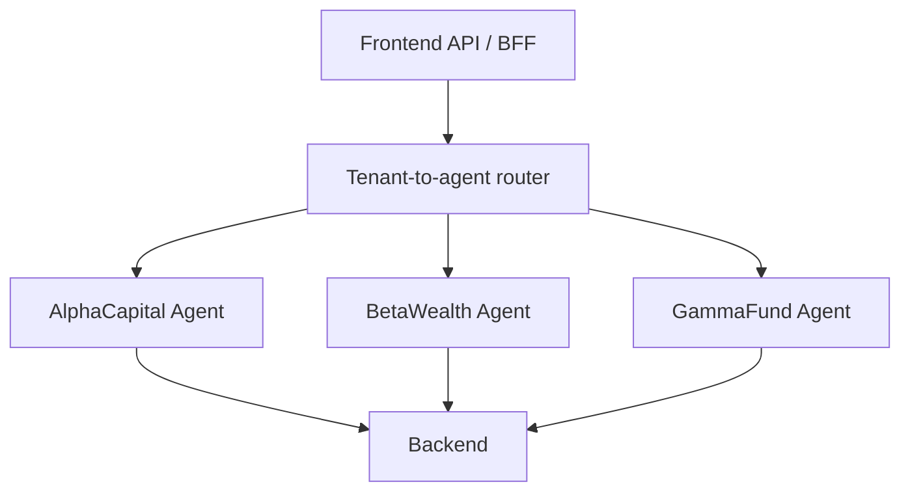
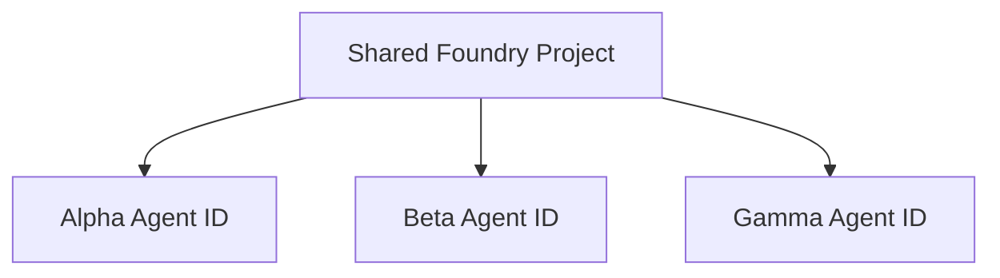
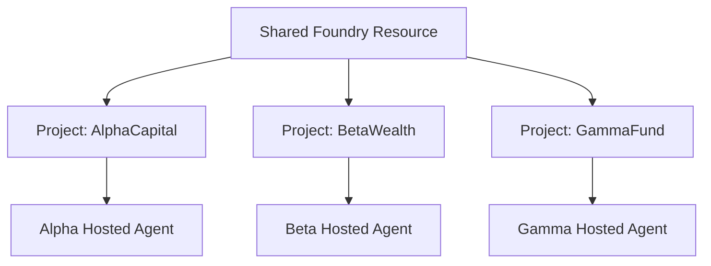
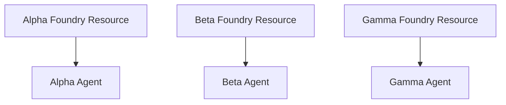
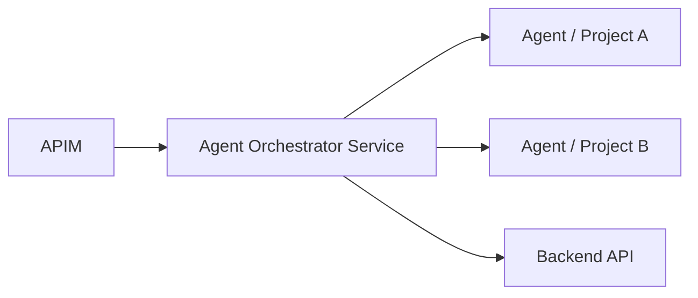

# Multi-Tenant Foundry Agent Isolation Patterns

## Contoso Asset Management POC

Comparison of hosted-agent identity and tenant isolation patterns for extending the current architecture.

---

# Decision Context

Contoso needs AI agents that can answer tenant-specific asset-management questions without crossing business-tenant boundaries.

Current non-negotiables:

- `extension_tenantId` from a validated token is the tenant authority.
- The SPA must not call backend or agent data paths directly.
- Backend API remains the final authorization and data-access boundary.
- Tenant data is isolated in one Cosmos DB account per business tenant.
- User tokens are never used as Cosmos credentials.

---

# Core Recommendation

Use a layered migration path:

| Stage | Recommended pattern | Why |
|---|---|---|
| Current POC | BFF-mediated hosted agent; Backend API remains data authority | Safest fit with current five-layer enforcement model |
| Stronger isolation | One Foundry project + one published hosted agent per tenant | Per-tenant agent identity, RBAC, and audit boundary |
| Strict regulated production | One Foundry resource/account per tenant | Separate network/security boundary per tenant |

---

# Pattern 1: Shared Agent + Tenant-Aware Tools

One hosted agent serves all tenants. Tenant context is injected per request and tools enforce tenant filtering in code.

---

# Pattern 1: Pros and Cons

| Pros | Cons |
|---|---|
| Lowest operational overhead | Weakest isolation; mostly application-code enforced |
| Fastest to demo | Shared agent identity and shared conversation/tool surface |
| Simple deployment and monitoring | Higher prompt-injection and context-pollution risk |
| Works if tools call Backend API only | Poor audit story for per-tenant agent identity |
| Good for early UX validation | Not recommended for regulated multi-tenant production |

---

# Pattern 2: BFF-Mediated Shared Hosted Agent

The SPA calls APIM and Frontend API/BFF. The BFF invokes the agent. Agent tools call Backend API, not Cosmos.

---

# Pattern 2: Pros and Cons

| Pros | Cons |
|---|---|
| Best fit for current architecture | Agent identity is not tenant-specific by default |
| Preserves APIM, BFF, Backend, and Cosmos enforcement | Tenant isolation depends on tool context and backend revalidation |
| Agent never needs direct Cosmos credentials | Requires refactoring current static portfolio tools |
| Low infrastructure change for POC | One shared agent can still create audit/noisy-neighbor concerns |
| Backend remains final data authority | Requires careful per-thread tenant binding |

---

# Pattern 3: Hosted Agent Per Tenant

Each business tenant gets its own published hosted agent. Each published hosted agent receives a dedicated Entra Agent ID.

---

# Pattern 3: Pros and Cons

| Pros | Cons |
|---|---|
| Clear per-tenant agent identity and audit trail | More deployments to manage |
| Smaller blast radius than shared agent | Shared project identity may still apply during development |
| Can disable/delete one tenant agent independently | Agent count quotas and lifecycle automation matter |
| Per-agent RBAC possible after publish | Still shares Foundry project/resource unless combined with other patterns |
| Stronger governance with Entra Agent ID | Requires tenant-aware routing in BFF/control plane |

---

# Pattern 4: Shared Foundry Project + Per-Tenant Agents

One Foundry project hosts multiple tenant-specific published hosted agents.

---

# Pattern 4: Pros and Cons

| Pros | Cons |
|---|---|
| Better identity isolation than one shared agent | Development-time agents may share project identity |
| Lower cost than project-per-tenant | Shared project assets increase misconfiguration risk |
| Easier centralized management | Project-level connections/vector stores need strict naming and RBAC |
| Good intermediate step | Not a strong admin boundary between tenant agents |
| Per-agent production audit possible | Not sufficient for strict regulated isolation by itself |

---

# Pattern 5: Foundry Project Per Tenant

Each tenant gets its own Foundry project, hosted agent, project identity, connections, indexes, and RBAC assignments.

---

# Pattern 5: Pros and Cons

| Pros | Cons |
|---|---|
| Strong project-level RBAC and admin boundary | Projects still share Foundry resource network boundary |
| Clean per-tenant project identity and connections | More IaC and onboarding automation |
| Good audit and cost-tagging model | Possible model deployment and quota multiplication |
| Works well with per-tenant Search indexes/storage | More complex tenant routing to project endpoint |
| Best balanced target for regulated POC | Requires disciplined role assignment scope |

---

# Pattern 6: Foundry Resource / Account Per Tenant

Each tenant gets a full Foundry resource/account stamp with its own project, agent, network, private endpoints, keys, and logs.

---

# Pattern 6: Pros and Cons

| Pros | Cons |
|---|---|
| Strongest isolation boundary | Highest cost and operational overhead |
| Separate network/security boundary per tenant | More subscriptions/resource groups/private endpoints |
| Best fit for strict PCI/SOX/sovereign requirements | Slower tenant onboarding without mature IaC |
| Cleanest incident blast-radius containment | More quota and capacity planning |
| Strong tenant-level chargeback and audit | Over-engineered for current POC |

---

# Pattern 7: Dedicated Agent Orchestrator Service

A separate service routes tenant requests to Foundry agents and enforces tenant policies before tool calls.

---

# Pattern 7: Pros and Cons

| Pros | Cons |
|---|---|
| Centralized tenant routing and policy enforcement | Adds a new service and trust boundary |
| Can manage per-tenant credentials/UAMIs outside the model | More code, monitoring, and deployment complexity |
| Good for advanced multi-agent routing | Duplicates some current BFF responsibilities |
| Strong audit and policy injection point | May reduce use of native Foundry tool patterns |
| Scales to complex agent portfolios | Not necessary for the current POC if BFF can own orchestration |

---

# Pattern Comparison Matrix

| Pattern | Identity isolation | Data isolation | Network isolation | POC fit | Production fit |
|---|---:|---:|---:|---:|---:|
| Shared agent + context | Low | Medium if backend-enforced | Low | High | Low |
| BFF-mediated shared agent | Medium | High via Backend API | Low | Very high | Medium |
| Hosted agent per tenant | High | High if RBAC/backend-enforced | Low/medium | Medium | High |
| Shared project + tenant agents | High in production | Medium/high | Low | Medium | Medium |
| Project per tenant | High | High | Medium | High | High |
| Foundry account per tenant | Very high | Very high | Very high | Low | Very high |
| Dedicated orchestrator | High | High | Depends on deployment | Medium | High |

---

# RBAC Isolation Options

| Resource | Tenant-scoped option | Notes |
|---|---|---|
| Azure AI Search | Index-level RBAC | Prefer `Search Index Data Reader` for query-only agents |
| Storage | Container-level RBAC | Useful for file search/vector store assets |
| Cosmos DB | Database/container SQL RBAC path | Avoid direct agent Cosmos access in POC |
| Key Vault | Vault-level RBAC | Use separate vaults for hard tenant secret isolation |
| App Configuration | Store-level RBAC | Labels/prefixes are not security boundaries |
| Foundry | Project-level RBAC | Projects do not provide separate network boundary |

---

# Recommended Contoso Path

| Phase | Action |
|---|---|
| 1 | Add architecture docs for hosted-agent placement and tenant guardrails |
| 2 | Add BFF `POST /api/tenants/{tenantId}/agent/chat` |
| 3 | Refactor portfolio-agent tools to call Backend API with validated tenant context |
| 4 | Add APIM route, JWT checks, tenant binding, and per-tenant rate limits |
| 5 | Add agent telemetry with `tenantId`, `userId`, `correlationId`, tool name, result |
| 6 | Evolve to project-per-tenant and hosted-agent-per-tenant when isolation needs increase |

---

# Guardrails

- Do not let the SPA invoke Foundry agents directly.
- Do not use `X-Tenant-Id` or prompt text as tenant authority.
- Do not let the model choose tenant IDs for tool calls.
- Do not reuse a Foundry thread across tenants.
- Do not give the POC agent direct Cosmos credentials.
- Do not capture full GenAI message content in production telemetry.
- Always revalidate at Backend API before tenant data access.

---

# Final Recommendation

For this POC, use **BFF-mediated hosted agent + Backend API data authority**.

For the target production pattern, use **one Foundry project and one published hosted agent per tenant**, with tenant-scoped RBAC and resources.

For strict regulated isolation, use **one Foundry resource/account per tenant** as a deployment stamp.

