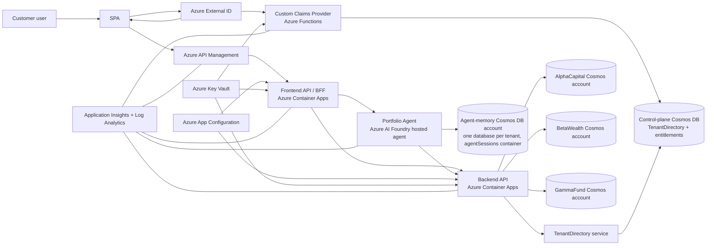
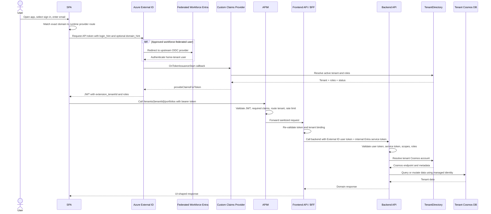
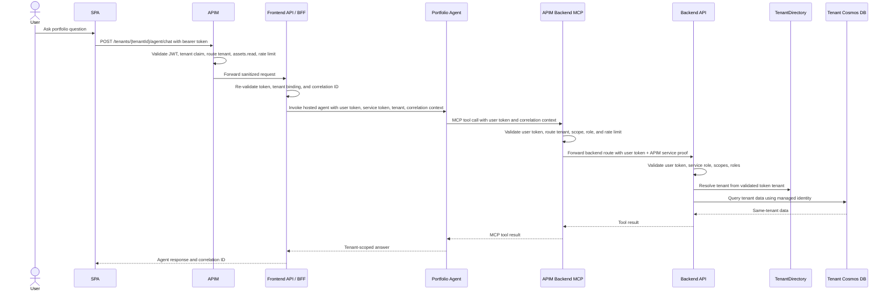
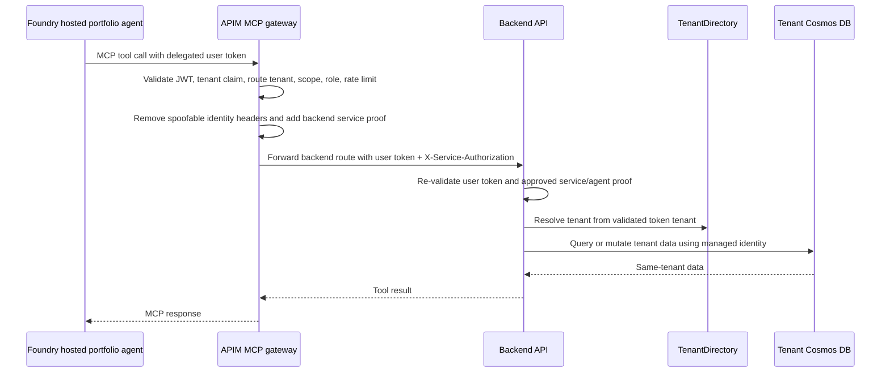
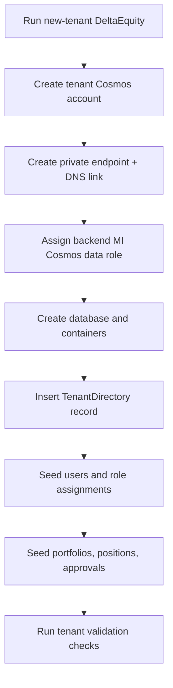

# Contoso Asset Management Multi-Tenant POC Architecture Design

## 1. Purpose

This document defines the target architecture for the Contoso Asset Management multi-tenant POC described in `docs/product-backlog.md`. The solution proves that a fictional FSI SaaS can securely serve independent customer tenants from a shared application platform while keeping tenant data physically isolated in separate Cosmos DB accounts.

The POC must be fully provisioned with Bicep through `azd up`, use private connectivity for data access, disable local database authentication, and demonstrate tenant isolation across sign-in, API access, data access, observability, and tenant onboarding.

## 2. Scope

### In scope

- Three initial business tenants: `AlphaCapital`, `BetaWealth`, and `GammaFund`.
- Fourth-tenant onboarding automation for `DeltaEquity`.
- Azure External ID sign-in for customer users.
- Controlled federation from approved Microsoft Entra workforce tenants into External ID.
- Custom Claims Provider that stamps tenant and role claims into API access tokens.
- Shared APIM front door.
- SPA calling a frontend API/BFF through APIM.
- Backend API as the final authorization and data-access boundary.
- One Cosmos DB account per tenant, plus a separate control-plane tenant directory store and a separate agent-memory Cosmos account for portfolio-agent conversation persistence.
- Private endpoints, private DNS, managed identity, and least-privilege RBAC.
- Optional Bastion-based operator access for read-only Cosmos Data Explorer demonstrations.
- Structured observability across APIM, frontend API, backend API, Custom Claims Provider, and Cosmos access.

### Out of scope for POC

- Production SLA and multi-region active-active design.
- Real financial data.
- General-purpose end-user registration UX; pre-authorized workforce federation is in scope.
- Full CI/CD automation beyond repeatable `azd` deployment.
- Production hardening items such as CMK, geo-replication, full OWASP review, and formal disaster recovery.

## 3. Architecture principles

| Principle | Design implication |
|---|---|
| Token tenant claim is authoritative | `extension_tenantId` from the validated token is the only trusted business-tenant selector. |
| Tenant switch requires a new token | Users do not switch tenants with `X-Tenant-Id` or request headers. |
| Defense in depth | External ID, APIM, frontend API, backend API, and Cosmos RBAC each enforce part of the security model. |
| Backend is final authority | APIM and frontend API are not trusted as the only authorization boundary. |
| Physical tenant data isolation | Each business tenant has its own Cosmos DB account. |
| Workload identity for data access | Backend managed identity accesses Cosmos; user tokens never reach Cosmos. |
| Private data plane | Cosmos public network access is disabled and private endpoints are required from day one. |
| Repeatable deployment | All Azure resources are represented in Bicep and deployed by `azd`. |

## 4. High-level architecture



## 5. Component design

| Component | Host | Responsibility |
|---|---|---|
| SPA | Azure Static Web Apps | Provides demo UI, signs users in with MSAL, displays token claims, and calls APIM. |
| Azure External ID | External customer identity tenant | Authenticates users and issues API access tokens. |
| Custom Claims Provider | Azure Functions with VNet integration | Handles `OnTokenIssuanceStart`, resolves active business tenant and tenant roles, and returns `extension_tenantId`, `roles`, and `tenant_status`. |
| APIM | Shared API gateway | Validates JWTs, enforces required claims, sanitizes spoofable headers, applies tenant-bound route checks, and rate-limits per tenant. |
| Frontend API / BFF | Azure Container Apps with VNet integration | Exposes UI-shaped routes, re-validates the user token, orchestrates backend calls, and never accesses Cosmos directly. |
| Portfolio Agent | Azure AI Foundry hosted agent | Handles portfolio chat through a BFF-mediated route, uses tenant-bound tool context, and never accesses tenant business-data Cosmos directly. It does access its own agent-memory Cosmos DB account directly (via managed identity) to persist conversation/tool-run session state, isolated per tenant. |
| Backend API | Azure Container Apps with VNet integration | Re-validates tokens and service authentication, enforces RBAC, resolves tenant-to-Cosmos mapping, and performs data operations. |
| Control-plane Cosmos DB | Separate Cosmos DB account | Stores tenant directory, user-to-tenant memberships, tenant role assignments, status, and Cosmos routing metadata. |
| Tenant Cosmos DB accounts | One Cosmos DB account per tenant | Stores tenant portfolios, positions, and transaction approvals with physical isolation. |
| Agent-memory Cosmos DB account | One Cosmos DB account, one database per tenant (`agent-memory-{tenant}`) | Stores the portfolio agent's serialized conversation/session state (`agentSessions` container, partitioned by `tenantId`, 30-day default TTL). Accessed only by the portfolio agent's managed identity; never holds portfolio, position, or transaction data. |
| App Configuration | Azure App Configuration | Stores non-secret environment settings and feature/config values. |
| Key Vault | Azure Key Vault | Stores secrets and certificates if needed; app access uses managed identity. |
| Observability | Application Insights + Log Analytics | Captures structured traces, APIM diagnostics, dependency telemetry, and alerts. |

## 6. Identity and token design

The identity tenant and business tenant are different concepts. Azure External ID is the application identity authority; the business tenant is an application-level claim used for authorization and data routing. Approved users from workforce tenant `66666666-6666-4666-8666-666666666666` can authenticate in their home tenant through External ID OIDC federation, but External ID still issues the access token consumed by the application.

Workforce federation uses three admission controls: enterprise-app assignment in the workforce tenant, a federated customer identity in External ID, and an active control-plane membership plus role assignment. The immutable source tenant/object ID pair links the upstream identity; email domains are never authorization boundaries. Setup and lifecycle procedures are in `docs/workforce-federation-setup.md`.

The SPA performs email-first authentication discovery. An exact, runtime-configured email-domain match can add `login_hint` and `domain_hint` to the External ID MSAL request to accelerate an enabled upstream provider. Unknown domains use External ID local sign-in, disabled domains fail before opening MSAL, and users can always open the unaccelerated provider picker. The typed email is ephemeral discovery input only and is never tenant authority.

The design uses these token planes:

| Token | Issuer | Audience | Used by | Purpose |
|---|---|---|---|---|
| User access token | Azure External ID customer tenant | Frontend API/APIM audience | SPA, APIM, frontend API, backend API | Delegated user authorization, tenant binding, scopes, and roles. |
| Service token | Internal MngEnv Entra tenant | Backend service audience | Frontend API and backend API | Proves the caller is the approved frontend API service identity. |
| Agent tool service proof | Internal MngEnv Entra tenant | Backend service audience | Portfolio agent tool path and backend API | Proves any agent-mediated backend call comes from an approved service identity. Initial Pattern 2 should reuse the BFF service-token path or keep tool execution inside the BFF until direct token transfer to the hosted agent is proven safe. |

The SPA only requests frontend API scopes from External ID. It does not know or request backend API scopes. The frontend API forwards the original user token to the backend for delegated authorization and sends a separate internal Entra service token for service-to-service authentication.

Required access-token claims:

| Claim | Purpose |
|---|---|
| `aud` | Ensures the token is for this API. |
| `iss` | Ensures the token came from the expected External ID tenant. |
| `scp` | Coarse delegated permissions such as `assets.read` and `assets.write`. |
| `roles` | Tenant-scoped roles such as `TenantAdmin`, `PortfolioManager`, and `PortfolioViewer`. |
| `extension_tenantId` | Authoritative business tenant binding. |
| `tenant_status` | Blocks suspended or inactive tenants. |
| `exp`, `nbf`, `iat` | Token lifetime controls. |

The Custom Claims Provider must fail closed when a user has no active tenant, has multiple tenants without an explicit selected tenant, or cannot resolve roles within the token issuance timeout.

## 7. End-to-end request flow



### Pattern 2 portfolio-agent chat flow

The initial portfolio-agent integration uses a BFF-mediated public route. APIM remains the only public API front door, the BFF remains the UI-facing orchestration layer, and the backend API remains the final tenant authorization and data-access boundary.



Direct APIM-to-agent routing is an evaluated alternative, but it is not the default for the POC. It can only replace the BFF route if it proves equivalent tenant binding, service authentication, safe token handling, correlation propagation, and agent tool guardrails. The portfolio-agent's own data access should use the APIM MCP endpoint instead of direct backend HTTP calls.

A parallel `portfolio-agent-python` custom-container hosted agent proves the same tool and
isolation design with Microsoft Agent Framework for Python. It is available through Foundry and
evaluation tooling only; the SPA/BFF continues to target the C# `portfolio-agent`. The Python
agent never calls the Backend API or tenant-data Cosmos accounts directly. Its tools use the same
APIM MCP boundary, and its conversation memory uses Python-prefixed per-tenant databases in the
shared agent-memory Cosmos account.

### Portfolio-agent conversation persistence

The portfolio agent ships a Cosmos-backed session store (`CosmosAgentSessionStore`, implementing the Foundry Agent Framework's `AgentSessionStore`) that can persist conversation/tool-run session state (the `AgentSession` state bag) to a dedicated agent-memory Cosmos DB account, independent of the tenant business-data Cosmos accounts and the control-plane Cosmos account:

- One Cosmos database per business tenant and agent implementation: `agent-memory-{tenant}` for
  the C# agent and `agent-memory-python-{tenant}` for the Python agent. Each database has one
  `agentSessions` container partitioned by `/tenantId` with a 30-day default TTL.
- The session document ID is derived from a SHA-256 hash of `{agentName}|{tenantId}|{userId}|{conversationId}`, and every document is stamped with `tenantId`, so a session can never be read back under the wrong tenant partition.
- The portfolio agent's managed identity is granted RBAC directly on this Cosmos account (Cosmos built-in data contributor), separate from the backend API's per-tenant Cosmos RBAC.
- The account follows the same private-data-plane conventions as the rest of the design: `disableLocalAuth: true`, `publicNetworkAccess: Disabled`, private endpoint, and the `privatelink.documents.azure.com` private DNS zone.
- The SPA-facing `conversationId` is now an opaque BFF-issued conversation handle used to resume the server-side Foundry Responses conversation and hosted-session binding. It must never be treated as a source of tenant authority or as a raw Foundry ID. Tenant context for session reads/writes always comes from the validated token/service context (`PortfolioToolContext`), not from the handle or its contents.

**Implemented — Responses v2 hosted-session affinity.** The frontend API now owns Foundry hosted-session lifecycle for chat calls while keeping conversation memory separate:

- The frontend API uses the **Responses v2** protocol. The hosted-agent declaration advertises Responses v2 only; Azure still retains Invocations endpoint/config support with `PortfolioAgent__UseInvocations=false`, but the BFF application code no longer includes an Invocations runtime path.
- On chat, the BFF resolves or creates a server-side binding from opaque `conversationId` handle + validated tenant + validated user to a Foundry Responses conversation ID and Foundry `agent_session_id`, then sends those stored IDs in the Responses v2 request body with `{ input, store, agent_session_id, conversation, metadata }`. Metadata is limited to small tenant/user/correlation values; long forwarded user and service tokens are sent through the same trusted headers the hosted agent consumes (`X-User-Authorization` and `X-Service-Authorization`) and duplicated with the `x-client-` prefix so the hosted Responses SDK exposes them in `ResponseContext.ClientHeaders`.
- The SPA never sees the Foundry `agent_session_id` or raw Foundry conversation ID. It receives only the opaque BFF handle in `AgentChatResponse.conversationId`, and can call `DELETE /api/tenants/{tenantId}/agent/sessions/{sessionHandle}` to clean up an owned hosted session.
- This implements Foundry Responses platform-managed message history plus hosted-session sandbox affinity and lifecycle ownership. The Cosmos agent-memory account and `CosmosAgentSessionStore` remain the separate mechanism for hosted-agent tool-run state.
- This store is unrelated to the `store: false` flag on the frontend API's Responses HTTP call — that flag only controls Foundry's own cloud-side response storage for that protocol call, not this hosted-agent-side Cosmos persistence.

### Backend MCP tool route for hosted agents

The backend API can also be exposed to the Foundry hosted portfolio agent as MCP tools through APIM. This is a second agent-oriented route and does not replace the SPA route through the BFF.



The MCP route is intended for Foundry hosted agents only. It exposes portfolio list, position detail, and transaction approval as APIM-governed tools. Transaction approval remains a write operation and requires `assets.write` plus `TenantAdmin` or `PortfolioManager`; the backend remains the final enforcement point.

For this demo, the backend Container App uses public ingress so APIM can reach it directly. Public ingress does not make the backend a trusted public API: backend routes still require the original user token and an approved internal Entra service token in `X-Service-Authorization`.

## 8. API design

### Frontend API / BFF routes

The frontend API exposes routes optimized for the SPA and delegates tenant-sensitive operations to the backend API.

| Operation | Route | Required scope | Required roles |
|---|---|---|---|
| Portfolio list | `GET /api/tenants/{tenantId}/portfolios` | `assets.read` | `TenantAdmin`, `PortfolioManager`, or `PortfolioViewer` |
| Position detail | `GET /api/tenants/{tenantId}/portfolios/{portfolioId}/positions/{positionId}` | `assets.read` | `TenantAdmin`, `PortfolioManager`, or `PortfolioViewer` |
| Approve transaction | `POST /api/tenants/{tenantId}/transactions/{transactionId}/approve` | `assets.write` | `TenantAdmin` or `PortfolioManager` |
| Portfolio agent chat | `POST /api/tenants/{tenantId}/agent/chat` | `assets.read` | `TenantAdmin`, `PortfolioManager`, or `PortfolioViewer` |

### Backend API routes

Backend routes may differ from BFF routes, but must always bind any route tenant to `extension_tenantId`.

| Operation | Route | Rule |
|---|---|---|
| Portfolio list | `GET /internal/tenants/{tenantId}/portfolios` | Resolve Cosmos from validated token tenant only. |
| Position detail | `GET /internal/tenants/{tenantId}/portfolios/{portfolioId}/positions/{positionId}` | Verify tenant, portfolio, and position belong to the same tenant. |
| Approve transaction | `POST /internal/tenants/{tenantId}/transactions/{transactionId}/approve` | Enforce write scope, role, tenant status, and transaction state. |

The frontend API must not pass a client-supplied tenant header as authority. If headers are used between services, they are trace/context hints only and must be derived from validated claims.

### Backend MCP tool routes

APIM exposes a Foundry-agent-facing MCP API at `/mcp/assets`. These routes map to the backend internal routes and preserve the same tenant-binding and dual-auth requirements.

| Tool operation | APIM MCP route | Backend route | Required scope | Required roles |
|---|---|---|---|---|
| Portfolio list | `GET /mcp/assets/tenants/{tenantId}/portfolios` | `GET /internal/tenants/{tenantId}/portfolios` | `assets.read` | `TenantAdmin`, `PortfolioManager`, or `PortfolioViewer` |
| Position detail | `GET /mcp/assets/tenants/{tenantId}/portfolios/{portfolioId}/positions/{positionId}` | `GET /internal/tenants/{tenantId}/portfolios/{portfolioId}/positions/{positionId}` | `assets.read` | `TenantAdmin`, `PortfolioManager`, or `PortfolioViewer` |
| Transaction approval | `POST /mcp/assets/tenants/{tenantId}/transactions/{transactionId}/approve` | `POST /internal/tenants/{tenantId}/transactions/{transactionId}/approve` | `assets.write` | `TenantAdmin` or `PortfolioManager` |

## 9. Data architecture

### Control-plane data

The control-plane Cosmos account stores routing and entitlement data.

| Entity | Key fields |
|---|---|
| Tenant | `tenantId`, `displayName`, `status`, `region`, `cosmosAccountEndpoint`, `databaseName`, `containerName` |
| UserTenantMembership | `userId`, `email`, `tenantId`, `status` |
| RoleAssignment | `userId`, `tenantId`, `roles`, `resourceAppId` |
| TenantOnboardingState | `tenantId`, `provisioningStatus`, `createdAt`, `updatedAt` |

### Tenant data

Each tenant Cosmos account stores only that tenant's application data.

| Entity | Key fields |
|---|---|
| Portfolio | `id`, `tenantId`, `name`, `currency`, `marketValue`, `asOfDate` |
| Position | `id`, `tenantId`, `portfolioId`, `instrumentName`, `assetClass`, `quantity`, `marketValue` |
| TransactionApproval | `id`, `tenantId`, `portfolioId`, `requestedBy`, `status`, `amount`, `createdAt`, `approvedBy`, `approvedAt` |

Even with account-per-tenant isolation, records should still include `tenantId` to simplify validation, diagnostics, seed scripts, and future migration paths.

### Agent-memory data

The agent-memory Cosmos account stores only portfolio-agent conversation/session state, never portfolio, position, or transaction data. It is provisioned and scoped independently of both the control-plane and tenant data accounts.

| Entity | Key fields |
|---|---|
| AgentSessionDocument | `id` (SHA-256 hash of `agentName\|tenantId\|userId\|conversationId`), `tenantId`, `documentType`, `agentName`, `userId`, `conversationId`, `stateBag` (serialized Foundry Agent Framework session state), `createdAt`, `updatedAt`, `ttl` (defaults to 2,592,000 seconds / 30 days) |

## 10. Security architecture

| Layer | Control |
|---|---|
| Token issuance | Custom Claims Provider resolves tenant and roles; missing or invalid tenant context fails closed. |
| APIM | `validate-jwt` with External ID OIDC discovery, required `extension_tenantId`, active `tenant_status`, route-to-token tenant comparison, spoofable header removal, and per-tenant rate limiting. |
| Frontend API | Re-validates token, checks tenant binding, performs BFF-only orchestration, and authenticates to backend. |
| Portfolio Agent | The BFF-connected C# agent and Foundry-only Python agent accept tenant authority only from trusted request context, never prompt text or client-controlled tenant values. Their tools use APIM MCP mediation and backend revalidation. Managed identities access only the shared agent-memory account's per-agent, per-tenant session databases, never tenant business-data accounts. |
| Backend API | Re-validates the External ID user token, validates the frontend API service identity using an internal MngEnv Entra service token, enforces scopes and roles, performs resource-level checks, and resolves Cosmos from server-side TenantDirectory. |
| Data plane | Cosmos access uses backend managed identity, Entra RBAC, `disableLocalAuth: true`, and private endpoints for tenant and control-plane accounts. The portfolio agent's managed identity has separate, narrowly scoped RBAC on the agent-memory Cosmos account only. |
| Secrets | Managed identities read Key Vault/App Configuration; no secrets are stored in source, Bicep parameter files, or `azd` environment files. |

Required negative tests:

- Unsigned token returns 401.
- Expired token returns 401.
- Wrong audience returns 401.
- Missing `extension_tenantId` returns 401 or 403.
- Route tenant mismatch returns 403.
- Spoofed tenant headers are ignored or overwritten.
- Direct backend call without approved service authentication is rejected.
- Agent chat route tenant mismatch is rejected before the portfolio agent is invoked.
- Agent prompt asking for another tenant's data returns a refusal or not-found response and does not return cross-tenant data.
- Agent tool execution without approved backend service proof is rejected.
- Cross-tenant API combinations return 403.
- Public Cosmos route access fails.

## 11. Networking architecture

The POC uses a hubless single-environment VNet design.

| Network item | Purpose |
|---|---|
| `snet-apps` | Container Apps environment integration for frontend and backend APIs. |
| `snet-func` | Azure Functions VNet integration for private control-plane access. |
| `snet-pe` | Private endpoints for Cosmos accounts and other private-link resources if required. |
| `snet-jumpbox` | Optional Windows operator VM used for private Cosmos Data Explorer access. |
| `AzureBastionSubnet` | Azure Bastion Basic ingress to the jumpbox without public RDP. |
| `privatelink.documents.azure.com` | Private DNS zone for Cosmos DB SQL API endpoints. |

Cosmos DB accounts must set:

- `publicNetworkAccess: 'Disabled'`
- `disableLocalAuth: true`
- Private endpoint in `snet-pe`
- Private DNS zone link to the VNet

Tenant data-plane access uses one user-assigned managed identity per business
tenant. The backend Container App receives the tenant identities, but each
tenant Cosmos account grants data-plane `DataContributor` only to its matching
tenant identity. The backend first resolves the tenant from the validated
`extension_tenantId`, reads the server-side TenantDirectory entry, and then uses
the `cosmosIdentityClientId` recorded for that tenant to access the tenant
Cosmos account. The backend system-assigned identity is reserved for
control-plane Cosmos reads and shared platform access, not tenant data-plane
writes.

Cloud-only development and validation from deployed app hosts remains the
default. Environments with `enableJumpbox=true` add the operator path defined
by ADR 0008: Azure Portal -> Bastion Basic -> Entra-joined Windows jumpbox ->
Azure Portal Data Explorer -> Cosmos private endpoint. The human operator has
Cosmos built-in Data Reader plus ARM Reader on every POC account; the VM
identity has no Cosmos role. The VM NSG allows RDP only from
`AzureBastionSubnet` and explicitly denies every other inbound source. Its
dedicated public IP is used only for outbound HTTPS, and nightly auto-shutdown
limits compute cost. Cosmos public access and local authentication remain
disabled.

Pattern 2 keeps the public chat path on APIM and the BFF. Direct APIM-to-agent routing remains an alternative only if Foundry hosted-agent endpoint authentication, network reachability, safe token handling, and correlation propagation are proven. The default design avoids direct SPA or APIM data-path calls to tenant resources and avoids direct agent access to Cosmos.

## 12. Deployment architecture

The repository should deploy with `azd up`.

```text
repo root
|-- azure.yaml
|-- infra/
|   |-- main.bicep
|   |-- main.parameters.json
|   `-- modules/
|       |-- network.bicep
|       |-- apim.bicep
|       |-- container-apps.bicep
|       |-- functions.bicep
|       |-- cosmos-control-plane.bicep
|       |-- cosmos-tenant.bicep
|       |-- app-configuration.bicep
|       |-- key-vault.bicep
|       `-- monitoring.bicep
|-- src/
|   |-- spa/
|   |-- frontend-api/
|   |-- backend-api/
|   |-- portfolio-agent/
|   `-- custom-claims-provider/
`-- scripts/
    |-- seed-data.*
    |-- validate-deployment.*
    `-- new-tenant.*
```

Bicep modules must parameterize environment name, location, tenant names, resource naming, External ID configuration, and SKU choices. No subscription IDs, tenant IDs, resource names, or secrets should be hard-coded.

## 13. Tenant onboarding design

Tenant onboarding automation creates a repeatable path for `DeltaEquity` and future tenants.



Target POC onboarding time is under 10 minutes.

## 14. Observability design

All components must emit structured logs with:

- `tenantId`
- `userId`
- `correlationId`
- operation name
- decision/result
- HTTP status code

JWT payloads, access tokens, refresh tokens, and secrets must never be logged.

| Source | Required telemetry |
|---|---|
| Custom Claims Provider | Token issuance decision, tenant resolution result, role resolution result, correlation ID, latency. |
| APIM | JWT validation failures, tenant mismatches, rate-limit events, request ID. |
| Frontend API | Route, tenant binding result, downstream backend call result, portfolio-agent invocation result. |
| Portfolio Agent | Agent invocation tenant ID, user ID hash or ID, correlation ID, tool name, tool result class, latency, and misses. Do not log JWTs, service tokens, or full sensitive claim payloads. |
| Backend API | Authorization decision, TenantDirectory lookup, Cosmos dependency call, domain operation result. |
| Validation scripts | Health, token claim, cross-tenant 403, and private DNS outcomes. |

Alert requirement: more than 5 tenant-mismatch 403 responses in 5 minutes should trigger an alert to the configured action group.

## 15. Success criteria mapping

| Backlog success criterion | Architecture support |
|---|---|
| `azd up` provisions and deploys all components | Bicep module structure and `azure.yaml` deployment mapping. |
| Six users receive correct claims | External ID + Custom Claims Provider + control-plane entitlements. |
| Three tenants are physically isolated | One Cosmos DB account per tenant. |
| All cross-tenant calls return 403 | APIM, frontend API, and backend route-to-token tenant checks. |
| Cosmos DNS resolves to private IP | Private endpoints and private DNS zone links. |
| Public Cosmos access fails | `publicNetworkAccess: 'Disabled'`. |
| Local auth disabled | `disableLocalAuth: true` and Entra RBAC. |
| Bad tokens and unauthorized calls are rejected | JWT validation, service authentication, scopes, roles, and tenant binding. |
| Fourth tenant onboarded under 10 minutes | Tenant onboarding automation flow. |
| Demo is repeatable | Seed scripts, validation scripts, observability, and demo-focused API operations. |
| Portfolio-agent chat preserves tenant isolation | APIM/BFF route, tenant-bound agent context, backend revalidation, and no direct agent access to tenant business-data Cosmos (the agent's only direct Cosmos access is its per-tenant agent-memory session store). |

## 16. Architecture decisions

| Decision | Recommended default | Status |
|---|---|---|
| Frontend API host | Azure Container Apps with VNet integration | Open |
| Backend API host | Azure Container Apps with VNet integration | Open |
| Custom Claims Provider host | Azure Functions with VNet integration | Open |
| Control-plane tenant mapping store | Separate Cosmos DB SQL API account | Open |
| Tenant data isolation | Cosmos DB account per business tenant | Recommended |
| Portfolio-agent conversation persistence store | Separate agent-memory Cosmos DB account, one database per tenant, portfolio-agent managed identity only | Closed |
| Portfolio-agent Responses conversation and hosted-session affinity | Responses v2 is the primary path; the BFF owns opaque conversation handles, stores Foundry conversation IDs and `agent_session_id` values server-side, sends them only in Responses v2 calls, and exposes an authenticated cleanup route. Invocations 1.0 is absent from the hosted-agent declaration and remains disabled rollback-only in Azure config. | Closed |
| Developer database access | Cloud-only for POC | Open |
| Region | East US or another region with confirmed service capacity | Open |
| SPA hosting | Azure Static Web Apps | Open |
| Pattern 2 portfolio-agent public boundary | APIM to Frontend API/BFF route; direct APIM-to-agent remains an evaluated alternative | Proposed |
| CI/CD | Manual `azd up` for POC; pipeline deferred | Closed for POC |

## 17. Implementation guardrails

- Do not use `X-Tenant-Id` or any client-controlled header as the source of tenant authority.
- Do not let the frontend API access tenant Cosmos accounts directly.
- Do not let the SPA call Foundry agents directly.
- Do not derive portfolio-agent tenant context from prompt text, request body tenant IDs, query strings, or conversation history.
- Do not reuse an agent thread across business tenants.
- Do not give the Pattern 2 portfolio agent direct access to tenant business-data Cosmos accounts in the POC; it may only access its own isolated agent-memory Cosmos account (per-tenant database, managed identity, session state only) for conversation persistence.
- Do not pass user tokens to Cosmos DB.
- Do not configure Cosmos connection strings or keys.
- Do not allow a default tenant fallback when claims are missing.
- Do not log JWTs or sensitive claim payloads.
- Keep Custom Claims Provider processing under 2 seconds.
- Validate APIM and backend authorization independently; either layer should reject unsafe requests.
- Keep tenant onboarding idempotent where possible so failed runs can be retried safely.
