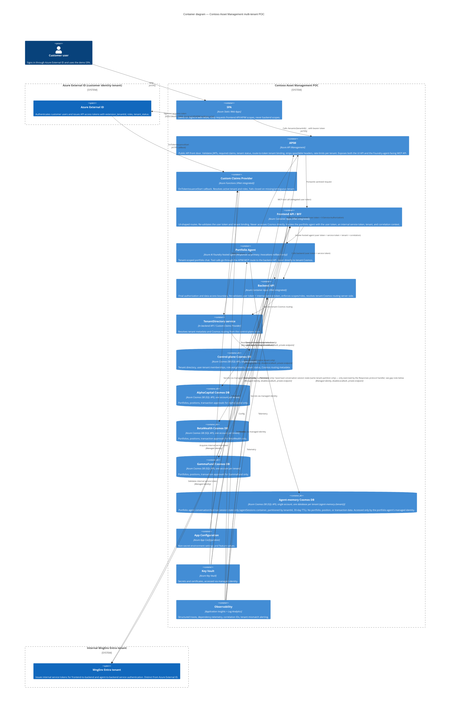

# C4 model — Contoso Asset Management multi-tenant POC

This diagram set complements `docs/architecture-design.md` with a C4-style container view. It is the source of truth for container-level shape (what talks to what, and which data store each container is allowed to touch); keep it in sync whenever a container, a Cosmos account, or a trust boundary changes.

## Container diagram

## Key correction vs. earlier revisions

Earlier drafts of the architecture doc described the portfolio agent as never accessing Cosmos directly. That is only true for **tenant business data**. In the actual implementation (`src/portfolio-agent/Program.cs`, `infra/modules/cosmos-agent-memory.bicep`), the portfolio agent's own managed identity connects directly to a **fourth Cosmos data plane** — the agent-memory account — to persist and retrieve its conversation/session state:

- Separate Cosmos account from the tenant business-data accounts and the control-plane account.
- One database per tenant (`agent-memory-{tenant}`), single `agentSessions` container, partitioned by `/tenantId`, 30-day default TTL.
- `disableLocalAuth: true`, `publicNetworkAccess: 'Disabled'`, private endpoint + `privatelink.documents.azure.com`, RBAC-only access for the portfolio agent's managed identity — consistent with the rest of the design's Cosmos conventions.
- The SPA-facing `conversationId` is now an opaque BFF-issued conversation handle, not a source of tenant authority or raw Foundry ID; tenant context always comes from the validated token/service context (`PortfolioToolContext`), never from the handle or its contents.
- This store is unrelated to the `store: false` flag used on the Foundry Responses HTTP call in the frontend API — that flag governs Foundry's own cloud-side response storage for that protocol call only, not this hosted-agent-side Cosmos persistence.

## Implemented — Responses v2 hosted-session affinity

Validated against `src/frontend-api/FrontendHandlers.cs`, `src/frontend-api/Agent/FoundryPortfolioAgentClient.cs`, and the Responses-only hosted-agent declaration:

- `CosmosAgentSessionStore` is invoked by `MapFoundryResponses()` (the Responses protocol handler, registered via `AddFoundryResponses(agent, agentSessionStore)`) and remains the separate conversation/tool-run state store.
- The frontend API uses the **Responses v2** protocol. The hosted-agent declaration advertises Responses v2 only; Azure keeps Invocations endpoint/config support with `PortfolioAgent__UseInvocations=false`, but the BFF application code no longer includes an Invocations runtime path.
- `FoundryPortfolioAgentClient.AskResponsesAsync` now sends the server-side stored `agent_session_id` and Foundry conversation reference in the Responses v2 body with `{ input, store, agent_session_id, conversation, metadata }`. Metadata only carries small tenant/user/correlation values; long user and service tokens are forwarded in the same trusted headers the hosted agent consumes (`X-User-Authorization` and `X-Service-Authorization`) plus `x-client-` prefixed copies for `ResponseContext.ClientHeaders`. The SPA receives only the opaque BFF handle in `conversationId` and can clean it up through `DELETE /api/tenants/{tenantId}/agent/sessions/{sessionHandle}`.
- **Net effect:** Foundry Responses message history and hosted-session sandbox affinity are implemented without exposing raw Foundry IDs to the SPA.

See `docs/architecture-design.md` sections 4, 5, 7 ("Portfolio-agent conversation persistence"), 9 ("Agent-memory data"), 10, 16, and 17 for the corresponding narrative updates.
