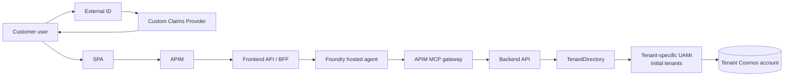
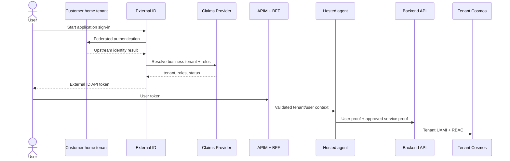
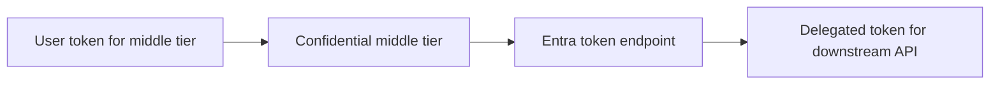
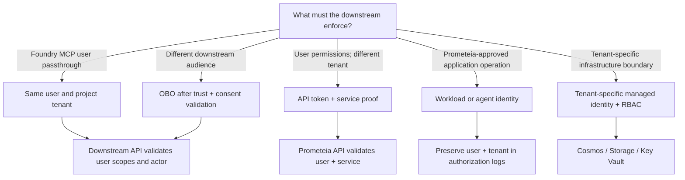
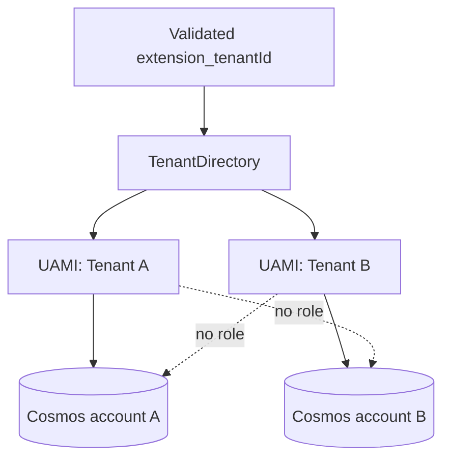
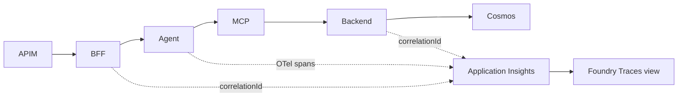
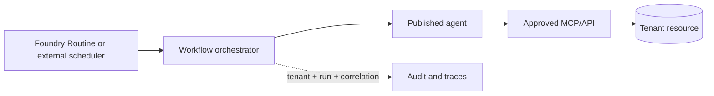

# Prometeia Multi-Tenant Agents and Identity

## What the POC proves, how identity should work, and what remains open

**Technical decision briefing**

<small>Prepared from the implemented Prometeia POC architecture and Microsoft product guidance current on 12 July 2026.</small>

<!--
Presenter note: This is an evidence-based briefing, not a product-roadmap
commitment. Call out the evidence legend on the next slide before discussing
the customer email.
-->

---

# How to read this deck

| Label | Meaning |
|---|---|
| **Implemented** | Present in source code, configuration, or IaC |
| **Runtime observed** | Exercised against Azure with an artifact in this repository |
| **Validated** | Positive and negative acceptance-test evidence is recorded |
| **Microsoft-documented** | Supported by current public Microsoft documentation |
| **Recommended** | Proposed architecture based on the requirement and constraints |
| **Open** | Requires Product Group confirmation, preview enrollment, or customer decision |

> **Rule:** Open questions stay open. This deck does not convert roadmap
> signals or private discussions into product commitments.

---

# Executive answers

| Customer requirement | Answer |
|---|---|
| Separate Cosmos DB per business tenant | **Implemented** |
| A tenant-specific service identity | **Implemented for initial tenants**; onboarding path needs alignment |
| Agent uses OBO for every downstream resource | **Refine**: OBO only where delegated user enforcement is required |
| Hosted-agent conversation logging | **Partial**: continuity/state exists; no conversation audit system of record |
| Hosted-agent traces visible in Foundry | **Instrumented**; repository has no captured trace-view evidence |
| Foundry evaluation | **Runtime observed, not scored**: judge blocked by evaluator RBAC |
| Evaluate non-Foundry agents | **Open**: tracing is documented; direct evaluation target support is not confirmed |
| Hosted versus prompt agent comparison | **Included; only hosted agent is implemented** |
| Routine scheduled workflow | **Recommended future pattern; not implemented** |
| Different roles per user in one tenant | **Implemented**; end-to-end role validation evidence is pending |

<small>POC assets: [architecture](architecture-design.md), [hosted-agent README](../src/portfolio-agent/README.md), and [evaluation suites](../src/portfolio-agent/evaluation-suites/).</small>

---

# What the repository implements today

- APIM and both API layers enforce tenant authorization.
- The agent never selects a tenant from prompt text.
- Business data access remains behind the backend API.
- Cosmos local auth and public access are disabled.
- Live positive/negative validation evidence is a separate completion gate.

<small>Source: [POC architecture](architecture-design.md#4-high-level-architecture).</small>

---

# Four different concepts must not be conflated

| Concept | Example purpose | Is it the SaaS tenant? |
|---|---|---:|
| Customer home tenant | Authenticates a customer's workforce users | No |
| External ID tenant | Issues application user tokens | No |
| Prometeia business tenant | Authorization, data routing, commercial boundary | **Yes** |
| Azure resource tenant | Hosts APIM, Foundry, managed identities, Cosmos | No |

> **Key point:** The SaaS tenant is validated application context, for example
> `extension_tenantId`; it is not inferred from the user's Entra tenant ID,
> email domain, or a request header.

<small>Sources: [External ID ADR](adr/0001-azure-external-id.md) and [architecture identity design](architecture-design.md#6-identity-and-token-design).</small>

---

# One application token issuer; authorize at every boundary

<small>Sources: [workforce federation setup](workforce-federation-setup.md) and [agent chat flow](architecture-design.md#pattern-2-portfolio-agent-chat-flow).</small>

---

# POC customer access scope

- Controlled, pre-provisioned workforce federation—not classic B2B guest collaboration.
- Access requires workforce enterprise-app assignment, an External ID federated identity, and an active business-tenant entitlement.
- External ID remains the application token issuer.
- Email and domain select a sign-in journey only; they never select or authorize a business tenant.
- Enabled domains receive `login_hint` and `domain_hint`; disabled domains are blocked; unknown domains use local External ID sign-in.
- A provider-picker fallback remains available.

> **Evidence gap:** The procedure and application behavior are implemented.
> Completed live federation acceptance evidence is not included in the
> repository.

<small>Source: [workforce federation setup](workforce-federation-setup.md#admission-model).</small>

---

# What current public documentation establishes

| Topic | Current documented position |
|---|---|
| External ID scope | External tenants target consumer **and business-customer** applications |
| Workforce federation | A documented External ID federation pattern uses OIDC; the current how-to has no preview marker |
| SAML/WS-Fed | Supported for external-tenant sign-up; direct SAML between two Entra tenants is not supported/recommended |
| Invitation flow | External-user invitation is preview and administrative; it is not compatible with CIAM user flows |
| HRD | `domain_hint` issuer/domain acceleration is documented for Entra, OIDC, and SAML federation |
| MFA trust | Cross-tenant MFA/device-claim trust applies to workforce tenants, not external tenants |

> **Open:** Protocol preview status, tenant enrollment, roadmap, and any behavior
> discussed privately still require Amine/Product Group confirmation.

<small>Microsoft Learn: [tenant configurations](https://learn.microsoft.com/entra/external-id/tenant-configurations), [Entra federation](https://learn.microsoft.com/entra/external-id/customers/how-to-entra-id-federation-customers), [SAML/WS-Fed](https://learn.microsoft.com/entra/external-id/direct-federation-overview), and [authentication methods](https://learn.microsoft.com/entra/external-id/customers/concept-authentication-methods-customers).</small>

---

# Groups, Graph, and governance need precise language

| Topic | Current documented position |
|---|---|
| Groups and app roles | App roles can be assigned to static security groups through Graph; token group claims contain object IDs |
| Automatic federation assignment | No automatic/dynamic group assignment pattern was found in public External ID documentation |
| Microsoft Graph | Supported external-tenant features are automatable; exact user/group/custom-property queries need scenario tests |
| Conditional Access | Available with a reduced set of conditions, grants, and session controls |
| ID Protection | Documented as not available in external tenants today |
| ID Governance | Documented as not available in external tenants today; “today” does not mean “never” |

<small>Microsoft Learn: [supported features](https://learn.microsoft.com/entra/external-id/customers/concept-supported-features-customers), [groups and app roles](https://learn.microsoft.com/entra/external-id/customers/reference-group-app-roles-support), and [cross-tenant access](https://learn.microsoft.com/entra/external-id/cross-tenant-access-overview).</small>

---

# Identity questions: evidence and ownership

| Follow-up | Public evidence can answer? | Owner for final answer |
|---|---:|---|
| SAML federation status/roadmap | Current support boundaries: yes; roadmap: no | Amine / Product Group |
| OIDC preview/GA/enrollment | How-to has no preview marker; tenant status still needs test | Amine / Product Group |
| MFA enforcement and home-tenant MFA trust | Current docs + policy test | Identity architecture |
| Automatic group assignment on federation | Partly; design-specific | Identity architecture / PG |
| Graph API limitations | Current Graph docs + live test | Engineering |
| Workforce versus External ID suitability | Scenario decision | Prometeia + Microsoft |
| Licensing and compliance | Not architecture alone | Prometeia + Microsoft account team |

<small>“Roadmap” and “tenant enrolled in preview” cannot be established from repository evidence.</small>

---

# Direct answer: OBO is not “a service principal accessing resources”

OAuth 2.0 On-Behalf-Of is a **delegated user token exchange**:

- A user assertion is required.
- The downstream API receives delegated user context.
- The token audience must be the downstream API.
- App consent, issuer trust, and tenant placement must support the exchange.

> **Do not conflate:** A managed identity or service principal obtains an
> **app-only** token. Calling that “OBO” does not make it delegated.

<small>Microsoft Learn: [OAuth 2.0 On-Behalf-Of flow](https://learn.microsoft.com/entra/identity-platform/v2-oauth2-on-behalf-of-flow).</small>

---

# Foundry MCP OAuth passthrough is blocked by the tenant split

Microsoft Foundry documents this requirement for OAuth identity passthrough:

> “The user's Microsoft Entra tenant must match the tenant of your Foundry
> project. Cross-tenant token exchange isn't supported.”

- The POC user token is issued by an External ID external tenant.
- Foundry and Azure resources live in a different workforce/resource tenant.
- Foundry MCP OAuth identity passthrough cannot bridge that split.
- Agent ID OBO is a separate flow; its issuer, audience, consent, and tenant
  requirements must be validated before applying it to this External ID split.
- The POC instead transports an already API-audienced user token as trusted
  tool context and adds an independent app-only service proof.
- Cosmos, Storage, and Key Vault use workload/agent identity plus RBAC.

<small>Microsoft Learn: [MCP authentication](https://learn.microsoft.com/azure/foundry/agents/how-to/mcp-authentication) and [agent OBO OAuth flow](https://learn.microsoft.com/entra/agent-id/agent-on-behalf-of-oauth-flow).</small>

---

# Choose identity from the authorization question

**Recommended default for this SaaS:** authorize the user at APIM/BFF/backend, then access infrastructure with least-privilege workload identity.

**Delegated enforcement has two alternatives:** pass through an already correctly
audienced user token, as this POC does, or perform OBO when the downstream API
requires a different audience and its trust, consent, issuer, and tenant
requirements are met. OBO is a token exchange; passthrough is not.

---

# Recommended token and identity matrix

| Hop | Authentication proof | Authorization enforced |
|---|---|---|
| SPA → APIM/BFF | External ID user token | Tenant, status, scope, role |
| BFF → Foundry | BFF managed-identity token; trusted user context forwarded separately | Invoke agent; bind hosted state to validated user |
| Agent → APIM MCP | Original, correctly-audienced External ID user token | Tenant, scope, role |
| APIM MCP → Backend | Same user token + new APIM UAMI app-only token | User permission + approved service caller |
| Backend → Cosmos | Selected tenant UAMI for initial tenants | Cosmos data-plane RBAC |
| Agent → agent memory | Agent workload identity | Agent-memory-only RBAC |
| Scheduled agent → approved tool | Agent/workload app-only identity | Job policy + least-privilege RBAC |

> **Two independent questions:** Is this user allowed? Is this workload allowed
> to perform the operation?

---

# Per-tenant isolation is stronger than a tenant header

- One Cosmos DB account per business tenant.
- Initial configured tenants use one tenant UAMI with RBAC only on its matching account.
- Endpoint and client ID are resolved server-side.
- `disableLocalAuth: true`; public network access disabled.
- Cross-tenant route/token mismatches fail before data access.

<small>Sources: [network and identity design](architecture-design.md#11-networking-architecture) and [Cosmos tenant module](../infra/modules/cosmos-tenant.bicep).</small>

> **Implementation gap:** The fourth-tenant onboarding template currently grants
> the backend system identity directly. Align it with the tenant-UAMI pattern
> before claiming this as a universal onboarding invariant.

---

# Different users can have different roles in one tenant

| Operation | Scope | Allowed roles |
|---|---|---|
| List portfolios | `assets.read` | TenantAdmin, PortfolioManager, PortfolioViewer |
| View position | `assets.read` | TenantAdmin, PortfolioManager, PortfolioViewer |
| Approve transaction | `assets.write` | TenantAdmin, PortfolioManager |

- The Custom Claims Provider resolves active membership and tenant roles.
- APIM, BFF, and backend revalidate the tenant binding.
- Tenant switching requires a newly issued token.
- Email, domain, body, query, or `X-Tenant-Id` never grants authority.

<small>Sources: [API authorization conventions](../contracts/README.md) and [POC architecture](architecture-design.md#10-security-architecture).</small>

---

# Foundry uses several identities—not one “agent service principal”

| Identity | Purpose |
|---|---|
| BFF caller identity | Invokes Foundry |
| Foundry project managed identity | Project/infrastructure operations |
| Development agent identity | Shared project agent identity before publishing |
| Published agent identity | Distinct production agent identity and audit actor |
| Delegated user identity | User-scoped tool/API access where supported |

**Design implication:** assign permissions to the identity that actually receives the downstream token. Publishing can create a distinct agent identity, so development RBAC must not be assumed to transfer automatically.

<small>Microsoft Learn: [Microsoft Entra Agent ID in Foundry](https://learn.microsoft.com/azure/foundry/agents/concepts/agent-identity).</small>

---

# Downstream access: use the right mechanism

| Resource | Recommended default | Use delegated OBO when... |
|---|---|---|
| Cosmos DB | Tenant UAMI + Cosmos RBAC | A custom API—not Cosmos directly—must enforce the user |
| Storage | Tenant/agent identity + scoped RBAC | The user owns the file permission boundary |
| Key Vault | Workload identity + vault/secret RBAC | Generally not for end-user delegation |
| MCP server | Agent/workload identity or API token + service proof | Native OAuth passthrough only for a supported same-tenant user flow |
| Prometeia API | User token + approved service/agent proof | The API exposes delegated scopes |

> **Rule:** Do not forward a user JWT to Azure infrastructure merely to preserve
> identity. Preserve user and tenant context in the application authorization
> decision and audit trail.

---

# Conversation continuity is not conversation logging

| Control | Purpose | POC state |
|---|---|---|
| Foundry conversation | Platform-managed message history | Used through Responses v2 |
| Foundry hosted session | Sandbox affinity/filesystem lifecycle | BFF-owned binding |
| Application agent memory | Tool-run/session state | Cosmos-backed, per tenant |
| Logs and traces | Operations, latency, tool calls, failures | OpenTelemetry + App Insights |

**Implemented:** conversation/session bindings, application state persistence,
and telemetry plumbing.

**Not demonstrated:** a durable, queryable conversation audit log with agreed
retention, redaction, access control, retrieval, and export.

> **Sensitive content:** Prompt/response capture is enabled only for demo trace
> visibility. Disable it for production or sensitive workloads unless
> retention, access, and privacy controls are explicitly approved.

<small>Sources: [hosted-session design](foundry-hosted-session-management.md) and [agent README](../src/portfolio-agent/README.md#validate-telemetry).</small>

---

# Trace instrumentation across Foundry and the application

Required dimensions:

- `tenantId`
- user ID or approved hash
- `correlationId`
- operation/tool name
- authorization decision/result
- status and latency

> **Evidence gap:** Instrumentation and the Foundry/Application Insights
> connection are implemented. The repository does not contain a captured
> trace-view artifact proving the full end-to-end visualization.

Microsoft documents server-side tracing as GA for prompt and hosted agents,
with traces displayed in Foundry for 90 days when Application Insights is
connected. Non-Foundry agent tracing is supported through OpenTelemetry.

<small>Sources: [POC observability design](architecture-design.md#14-observability-design) and [Foundry trace setup](https://learn.microsoft.com/azure/foundry/observability/how-to/trace-agent-setup).</small>

---

# Foundry evaluation: baseline invoked, not scored

| Stage | Result |
|---|---|
| Dataset uploaded | 15-item `smoke-core` dataset |
| Hosted target invoked | **Version 2 produced candidate responses for all 15 items** |
| Tool calls | Real tool call/output pairs observed |
| LLM judge | **Errored for all 15 items** |
| Root cause | Evaluator principal lacked `OpenAI/responses/write` data action |
| Next action | Grant least-privilege evaluation model data-plane role and rerun |

> **Interpretation:** Do not present `0 passed / 15 errored` as an agent-quality
> failure—or as a passing evaluation. The failure occurred in the judge step.

This run did **not** exercise the currently deployed version, the BFF/APIM
authorization path, or a tenant-isolation workflow.

<small>Historical run outputs are intentionally excluded from the public template. Run the checked-in suites in your own Foundry project to produce environment-specific evidence.</small>

---

# Evaluation should cover quality and isolation

| Suite | What it proves |
|---|---|
| Smoke baseline | Invoked once; judge blocked |
| Domain regression | Authored, not yet executed |
| Tenant safety | Authored, not yet executed |
| Tool diagnostics | Authored, not yet executed |
| Authorization | Required future deterministic checks |
| Operational | Required future trace/latency/error checks |

**Non-Foundry agent:** Foundry tracing is explicitly supported. Trace evaluation
is preview and can score prior interactions from Application Insights; the
current guide does not confirm direct live invocation of an external-agent
target.

<small>POC assets: [`datasets/`](../src/portfolio-agent/datasets/) and [`evaluators/`](../src/portfolio-agent/evaluators/).</small>

---

# Hosted agent versus prompt agent

| Dimension | Hosted agent | Prompt agent |
|---|---|---|
| Runtime | Custom hosted code/container | Managed prompt-centric definition |
| Code and dependencies | Full control | Lower operational surface |
| Custom protocols/tools | Strong fit | Prefer built-in/managed capabilities |
| Session/filesystem behavior | Per-session sandbox and persistent filesystem | Managed service behavior |
| Deployment overhead | Higher | Lower |
| Best fit | Custom orchestration, libraries, MCP adapters | Rapid prompt/tool configuration |

> **POC choice:** Custom tenant context, backend/MCP integration, session
> handling, and telemetry led to a **hosted agent**. A fair prompt-agent
> comparison should reuse the same dataset and authorization-safe tool boundary.

<small>POC evidence: [hosted-agent declaration](../src/portfolio-agent/agent.yaml).</small>

---

# Foundry Routines: scheduled execution is app-only

- Use an app-only workload or published-agent identity.
- Scope each run to one business tenant.
- Resolve tenant resources server-side.
- Apply idempotency, retry, approval, and kill-switch controls.
- Never reuse an interactive user's token for an unattended job.

**Microsoft Foundry Routines:** Public Preview; supports schedule and one-shot
timer triggers, requires an agent with configured agent identity, and rejects
prompt-only agents for routine actions.

**POC state:** future work; no scheduled business-agent workflow is implemented.

<small>Microsoft Learn: [Use routines](https://learn.microsoft.com/azure/foundry/agents/how-to/use-routines).</small>

---

# External ID or workforce tenant? Start with the scenario

| Requirement | External ID pattern | Workforce tenant pattern |
|---|---:|---:|
| Customer-facing SaaS identity plane | Candidate fit | Possible, but not CIAM-focused |
| Local/social/customer identities | Candidate fit | Not the primary model |
| Partner access to workforce/M365 apps | Not the primary model | Candidate fit |
| Classic B2B collaboration controls | Different customer-federation model | Candidate fit |
| Customer-specific claims and journeys | Candidate fit | App-specific implementation |
| Advanced workforce governance controls | Validate capability/licensing | Candidate fit |
| One stable application token issuer | Candidate fit | Depends on design |

> **Decision gate:** The choice cannot be made from “B2B” alone. Prometeia must
> rank customer UX, federation protocols, governance, lifecycle, compliance,
> and licensing.

---

# Recommended SaaS architecture

1. Choose one application token issuer; upstream authentication may remain in customer home tenants.
2. Keep business tenancy as application authorization context.
3. Validate user tenant, role, and scope before every agent/data operation.
4. Use the backend API as the final authorization and routing boundary.
5. Use tenant-specific managed identities for physically isolated resources.
6. Consider a published agent identity for agent-owned actions and audit where supported.
7. Apply Foundry MCP OAuth passthrough only within its documented same-tenant boundary; validate Agent ID OBO separately.
8. Keep roadmap-dependent federation/governance decisions behind explicit validation gates.

> **Recommendation:** This is a viable SaaS pattern even when the customer
> identity tenant and Azure resource tenant are different—provided token
> issuers, audiences, consent, and service identities are separate trust planes.

---

# Phased next steps

| Phase | Action | Exit evidence |
|---|---|---|
| 1. Close identity facts | PG answers + tenant tests for federation, MFA, groups, Graph, HRD | Signed question tracker |
| 2. Close evaluation RBAC | Assign evaluation-model data-plane role and rerun | Scored Foundry report |
| 3. Prove isolation | Run tenant/user/session negative tests | 403/404 + correlated traces |
| 4. Decide production identity plane | Apply suitability, licensing, compliance matrix | Architecture decision |
| 5. Add unattended workflow | App-only tenant-scoped job | Audited scheduled run |
| 6. Compare agent types | Same tools, dataset, rubric, and safety tests | Evidence-based comparison |

---

# Decisions needed in the follow-up session

1. Is Prometeia's user population a customer SaaS population, a partner workforce population, or both?
2. Which federation protocols and tenant enrollments are required at launch?
3. Which tenant must enforce MFA, device, risk, and authentication-method policy?
4. Are groups an upstream entitlement signal, an app assignment mechanism, or the final application role model?
5. Which lifecycle and governance controls are mandatory for production?
6. Which downstream APIs truly require delegated user enforcement?
7. What conversation content may be retained, where, and for how long?
8. What evidence is required before selecting External ID or a workforce resource tenant?

---

# Appendix: original scope status

| Priority | Item | Status | Answer |
|---|---|---|---|
| Must | Multi-tenant, separate Cosmos | Implemented | Account per business tenant |
| Must | Each tenant has a service principal | Partial/refined | Tenant UAMI for initial accounts; align onboarding |
| Must | Agent OBO to all resources | Reframed | MCP passthrough is same-tenant; OBO needs explicit trust validation |
| Must | Hosted conversation logging | Partial | Continuity/state exists; audit log not demonstrated |
| Must | Foundry trace visibility | Instrumented | OTel + App Insights; captured view not evidenced |
| Must | Foundry evaluation | Runtime observed | Version 2 invoked; judge RBAC blocked |
| Nice | Non-Foundry evaluation | Partial/open | Trace evaluation is preview; direct live target not documented |
| Nice | Cross-agent observability | Recommended | Common OTel schema and correlation |
| Nice | Hosted vs prompt | Explained | Hosted only implemented |
| Nice | Scheduled workflow | Future | App-only tenant-scoped job |
| Nice | Per-user tenant roles | Implemented | Claims + scope/role enforcement; live validation pending |

---

# Appendix: customer identity follow-up tracker

| Question | Deck position | Required closure |
|---|---|---|
| External ID SAML federation | Supported with boundaries; Entra-to-Entra direct SAML excluded | Formal roadmap response + tenant test |
| OIDC preview/GA/enrollment | Current Entra federation how-to has no preview marker | Formal status response + tenant test |
| MFA trust and methods | Architecture must identify enforcing tenant | Policy matrix + sign-in test |
| Group assignment on federation | Do not equate groups with app roles | Provisioning/claims design |
| Graph limitations | Validate exact resources/properties | API test matrix |
| Workforce vs External ID | Scenario-dependent | Licensing/compliance/UX decision |
| Documentation/follow-up | This deck is the question framework | Agreed owner and answer date |

---

# Appendix: non-negotiable security guardrails

- Never accept client-controlled tenant context as authority.
- Never let a model choose the tenant or credential used by a tool.
- Never reuse a conversation/session binding across tenant and user ownership.
- Never send a token to the wrong audience.
- Never use a user token as a Cosmos, Storage, or Key Vault credential.
- Never expose raw Foundry conversation or hosted-session IDs to the browser.
- Never log access tokens, refresh tokens, secrets, or full sensitive claims.
- Disable full prompt/response trace capture for production unless explicitly approved.
- Fail closed when tenant, role, status, service proof, or routing cannot be resolved.

<small>Sources: [security architecture](architecture-design.md#10-security-architecture) and [hosted-session security controls](foundry-hosted-session-management.md#security-controls).</small>

---

# Appendix: reference set

## POC evidence

- [Architecture design](architecture-design.md)
- [External ID decision](adr/0001-azure-external-id.md)
- [Workforce federation setup](workforce-federation-setup.md)
- [Foundry hosted-session design](foundry-hosted-session-management.md)
- [Portfolio agent](../src/portfolio-agent/README.md)
- [Evaluation suites](../src/portfolio-agent/evaluation-suites/)

## Microsoft documentation

- [OAuth 2.0 On-Behalf-Of flow](https://learn.microsoft.com/entra/identity-platform/v2-oauth2-on-behalf-of-flow)
- [Microsoft Entra External ID documentation](https://learn.microsoft.com/entra/external-id/)
- [External ID external tenant overview](https://learn.microsoft.com/entra/external-id/customers/overview-customers-ciam)
- [External tenant supported features](https://learn.microsoft.com/entra/external-id/customers/concept-supported-features-customers)
- [Microsoft Entra workforce federation](https://learn.microsoft.com/entra/external-id/customers/how-to-entra-id-federation-customers)
- [Microsoft Foundry Agent Service documentation](https://learn.microsoft.com/azure/foundry/agents/overview)
- [Microsoft Entra Agent ID documentation](https://learn.microsoft.com/entra/agent-id/)
- [Foundry tracing](https://learn.microsoft.com/azure/foundry/observability/how-to/trace-agent-setup)
- [Foundry evaluations](https://learn.microsoft.com/azure/foundry/observability/how-to/evaluate-agent)
- [Foundry routines](https://learn.microsoft.com/azure/foundry/agents/how-to/use-routines)

<small>Product status, preview enrollment, licensing, and roadmap must be reconfirmed for the target Prometeia tenants.</small>
