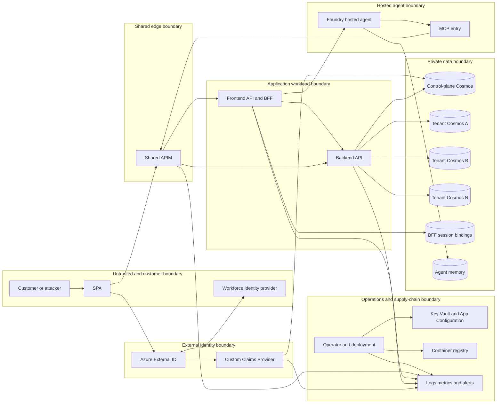
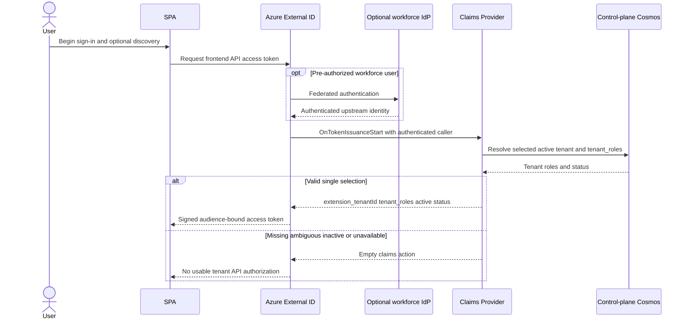
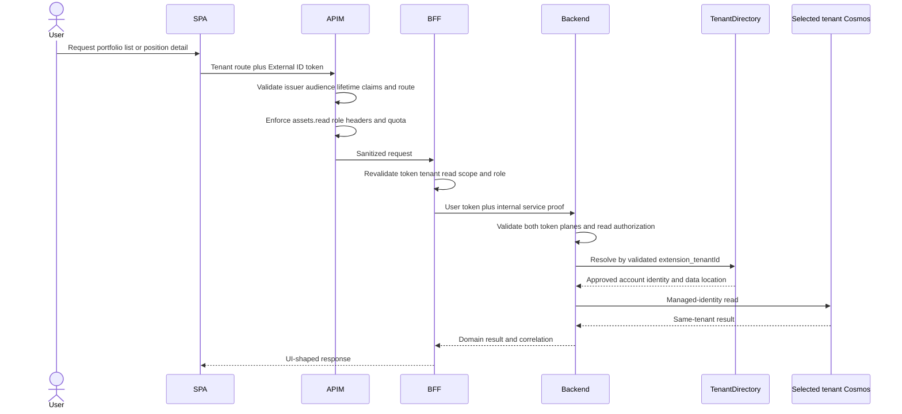
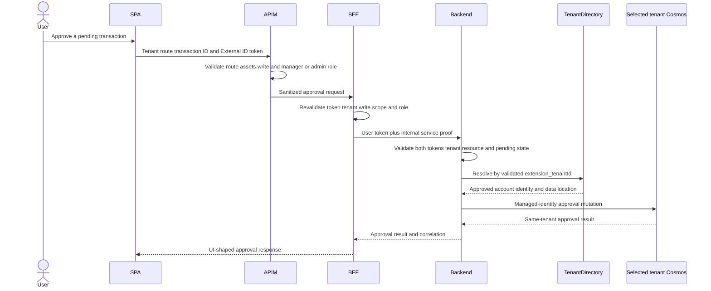
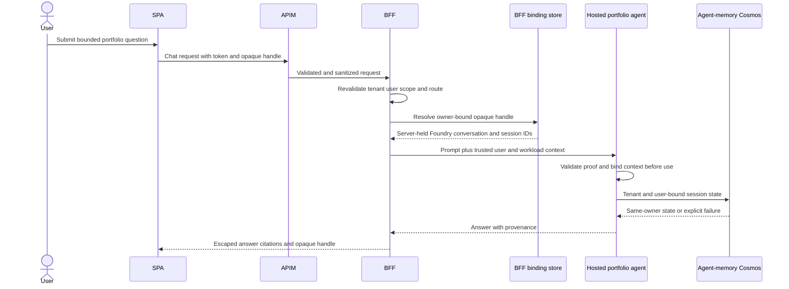
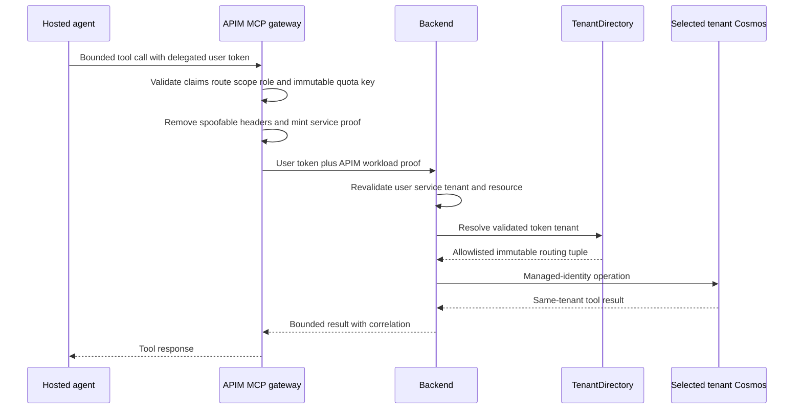
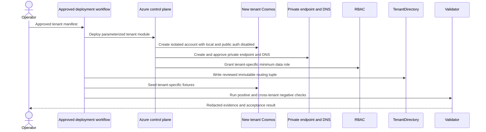
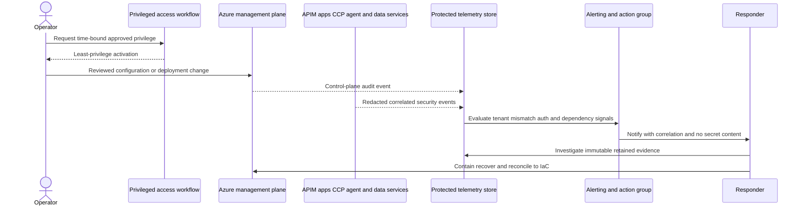

# Contoso Asset Management Threat Model and Security Posture

**Assessment snapshot:** 2026-07-12

**Method:** STRIDE, evidence-led design and implementation review, plus supplied
read-only live observations

**Decision:** Suitable for a controlled POC only; not ready for production

## 1. Executive summary

The POC has a strong tenant-data foundation: business data is split across
separate Cosmos DB accounts, all assessed Cosmos accounts disable public and
local authentication, private endpoints and private DNS are present, the
backend uses managed identity, and user and service authorization are checked
in layers. The backend remains the final data boundary. Owner-bound opaque BFF
session handles, a tenant-mismatch alert, and HTML escaping further reduce
cross-tenant and model-output risk.

The overall posture is nevertheless **high concern outside a controlled POC**.
Three critical technical or governance risks require urgent action:

- the Custom Claims Provider (CCP) is anonymously reachable;
- a process-global agent context fallback can reuse another request's context;
- Cosmos data-plane assignments are account-wide and include unexplained
  contributors.

A fourth critical item is governance validation of inherited subscription
Owner and User Access Administrator assignments. Their counts are confirmed,
but business justification was not assessed; the finding is not a claim that
each assignment is improper.

High risks also include divergent MCP entry policies, unbound hosted-agent
authorization metadata, default capture of GenAI message content, public
application and AI platform ingress, incomplete diagnostics, and a plaintext
Context7 credential. The credential is confirmed **only in the modified
working tree**. Safe checks of current `HEAD` and reachable local history did
not find that value; remote exposure was not established. Rotation is still
immediate because workspace, editor, backup, or future-commit exposure remains
possible.

An unauthenticated CCP probe returned HTTP 200, but its body was suppressed.
Because the CCP deliberately uses HTTP 200 for fail-closed empty-action
responses, the probe proves anonymous reachability, **not** that usable claims
were disclosed.

No aggregate security score is provided. A single number would hide the
contrast between strong Cosmos network isolation and material identity, agent,
governance, telemetry, and operations gaps.

## 2. Scope, snapshot, limitations, and evidence

### 2.1 Scope

This report covers:

- External ID authentication and claim enrichment;
- SPA, shared APIM, frontend API/BFF, backend API, and hosted portfolio agent;
- native and legacy MCP tool paths;
- control-plane, tenant-data, BFF-session, and agent-memory Cosmos stores;
- onboarding, managed identities, RBAC, private networking, configuration,
  secrets, observability, operator access, and container supply chain;
- the six required flows in sections 6.1-6.6 and the supporting operator flow
  in section 6.7.

This is a point-in-time POC threat model, not a penetration test, compliance
opinion, source-code proof of absence, or production authorization.

### 2.2 Dirty working-tree warning

The current working tree is dirty and contains uncommitted evidence. Therefore:

- **static evidence** means behavior present in the inspected working tree;
- **design evidence** means intended behavior in architecture, contracts, ADRs,
  backlog, or runbooks and is not implementation proof;
- **live evidence** means supplied read-only observations of deployed Azure
  configuration or low-volume probes and is not proof that deployed bits match
  local source;
- a `STATIC` working-tree observation must not be described as committed,
  reviewed, deployed, or present on a remote unless separately proven.

The plaintext Context7 credential is the clearest example: it is present in a
modified tracked file, while safe current-`HEAD` and history checks did not
confirm the value in committed history. Remote branches, pull-request
artifacts, editor history, backups, and third-party use were not fully
established.

### 2.3 Evidence labels

| Label | Meaning |
|---|---|
| `STATIC` | Confirmed in the current working tree at the cited path/lines. |
| `DESIGN` | Requirement or claimed control in design documents/contracts; not implementation proof by itself. |
| `LIVE` | Supplied read-only deployed-state observation. |
| `PROBE` | A `LIVE` low-volume request with response body suppressed. |
| `GAP` | Evidence was absent, inconclusive, or intentionally not collected. |

Live evidence was treated as point-in-time and redacted. No secret, token, key,
principal ID, subscription/tenant ID, or unnecessary resource identifier is
reproduced here.

### 2.4 Limitations

- No destructive testing, exploitation, load test, or broad authenticated
  probing was performed.
- Probe bodies were suppressed; status codes alone do not prove returned data.
- The full browser sign-in, federation, token replay, and tenant-switch flows
  were not exercised during this evidence pass.
- Principal identities and business justifications were intentionally not
  inspected in detail.
- A local history result does not establish whether a secret appeared in every
  remote, fork, pull request, log, editor history, or backup.
- Live configuration can drift after the snapshot.
- Model evaluations provide sampled assurance, not proof against all prompt
  injection or leakage.
- Formal privacy, regulatory, data-residency, disaster-recovery, and software
  composition assessments remain separate work.

## 3. STRIDE methodology and risk rubric

### 3.1 STRIDE categories

| Category | Security property | Examples in this system |
|---|---|---|
| Spoofing | Authentic identity | Forged CCP caller, reused agent context, unapproved workload caller |
| Tampering | Integrity | Poisoned tenant routing, policy drift, altered session state |
| Repudiation | Accountability | Missing diagnostics, ambiguous state-store failures |
| Information disclosure | Confidentiality | Cross-tenant data, prompt/tool telemetry, credential exposure |
| Denial of service | Availability/cost | Unbounded prompts, direct-host traffic, claim callback flooding |
| Elevation of privilege | Authorization | Broad RBAC, weaker MCP path, forged tenant/role context |

Each trust boundary and flow was reviewed for all six categories. Findings are
root-cause oriented: one finding can map to several STRIDE threats.

### 3.2 Likelihood rubric

| Rating | Name | Interpretation |
|---:|---|---|
| 1 | Rare | Requires exceptional access or several unlikely preconditions. |
| 2 | Unlikely | Credible but difficult, uncommon, or strongly constrained. |
| 3 | Possible | Practical with meaningful access, knowledge, or timing. |
| 4 | Likely | Repeatable with common access or a plausible failure mode. |
| 5 | Almost certain | Presently exposed, easy to trigger, or expected under normal misuse. |

### 3.3 Impact rubric

| Rating | Name | Interpretation |
|---:|---|---|
| 1 | Negligible | No sensitive data or durable service effect. |
| 2 | Limited | Localized POC disruption or readily reversible error. |
| 3 | Moderate | Material single-service, cost, audit, or tenant effect. |
| 4 | Major | Sensitive disclosure, durable outage, or broad authorization effect. |
| 5 | Severe | Cross-tenant/systemic compromise or subscription/control-plane takeover. |

### 3.4 Severity matrix

Severity is based on `likelihood × impact`.

| Impact \ Likelihood | 1 | 2 | 3 | 4 | 5 |
|---:|---:|---:|---:|---:|---:|
| **5** | Low 5 | Medium 10 | High 15 | Critical 20 | Critical 25 |
| **4** | Low 4 | Medium 8 | High 12 | High 16 | Critical 20 |
| **3** | Low 3 | Medium 6 | Medium 9 | High 12 | High 15 |
| **2** | Low 2 | Low 4 | Medium 6 | Medium 8 | Medium 10 |
| **1** | Informational 1 | Low 2 | Low 3 | Low 4 | Low 5 |

| Score | Severity |
|---:|---|
| 20-25 | Critical |
| 12-19 | High |
| 6-11 | Medium |
| 2-5 | Low |
| 1 | Informational |

### 3.5 Status and confidence

| Status | Meaning |
|---|---|
| Open | Action is required. |
| Partially Mitigated | Material controls exist, but the root risk remains. |
| Mitigated | Control is implemented and verified for this snapshot. |
| Accepted for POC | Explicitly tolerable only for the controlled POC. |
| Needs Validation | Evidence is insufficient for a defect or closure claim. |
| Open before production | May remain for the POC but blocks production. |

| Confidence | Meaning |
|---|---|
| High | Direct code/configuration or unambiguous live evidence. |
| Medium | Strong evidence with an untested precondition or suppressed detail. |
| Low | Inference, incomplete ownership/context, or substantial evidence gap. |

Risk acceptance must identify an owner, expiry, scope, rationale, and
compensating controls. “Accepted for POC” is not production acceptance.
Here it records a documented POC trade-off, not proof of completed formal
governance approval.

## 4. Actors, assets, components, and tenant concepts

### 4.1 Actors

| Actor | Intended capability | Threat relevance |
|---|---|---|
| Customer user | Read portfolios/positions; approve when authorized; use chat | May be malicious, compromised, or overprivileged |
| Federated workforce identity provider | Authenticate approved home-tenant users | Upstream admission and identity-linking risk |
| Azure External ID | Authenticate and issue application access tokens | Sole customer token issuer |
| Internal MngEnv Entra | Issue backend-audience service tokens | Independent workload identity plane |
| CCP | Resolve active membership, tenant, role, and status | High-value issuance dependency |
| APIM identity | Front door and MCP workload proof | Shared policy and quota enforcement |
| Frontend API/BFF identity | UI orchestration, backend/Foundry invocation | Owns opaque session bindings |
| Hosted portfolio agent/model | Interpret prompts and request bounded tools | Non-deterministic and prompt-injection exposed |
| Backend API identity | Final authorization and tenant data access | High-value cross-tenant boundary |
| Onboarding/deployment identity | Create resources, routing, seed data, and RBAC | High privilege; must be time-bound |
| Operator/security responder | Configure, observe, recover, and review | Insider, compromise, and repudiation risk |
| Internet attacker | Scan/flood public surfaces and reuse leaked material | No legitimate tenant or service trust |
| Dependency/registry publisher | Supply SDKs, images, models, or MCP services | Supply-chain and data-egress risk |

### 4.2 Assets and data classification

The repository does not define a formal classification taxonomy. The labels
below are assessment classifications used to express handling requirements.

| Classification | Assets | Required handling |
|---|---|---|
| Restricted | Access/service tokens, credentials, portfolio/position/transaction data, entitlements, tenant routing, prompts/tool output, session memory | Least privilege, no logs, encryption, private paths, strict retention |
| Confidential | User/tenant/role mappings, audit events, correlation context, deployment metadata, model evaluation results | Role-bound access, minimization, retention and integrity controls |
| Internal | Source, IaC, policies, architecture, operational procedures | Review, change control, provenance, secret scanning |
| Public | Deliberately published static assets and non-sensitive API descriptions | Integrity and release controls |

Tenant identity, role, status, routing, and agent-session state are authorization
data even when they do not contain business records. Tampering with them can be
as damaging as direct data disclosure.

### 4.3 Components

| Layer | Components | Security responsibility |
|---|---|---|
| Client/identity | SPA/Static Web Apps, External ID, workforce federation, internal MngEnv Entra, CCP | Authenticate, issue user/service tokens, bind active business tenant |
| Edge | Shared APIM, legacy APIs, native MCP server | Validate, sanitize, authorize, rate-limit, correlate |
| Application | BFF, backend API | Revalidate; orchestrate; enforce final resource authorization |
| Agent | Foundry endpoint/session service, C#/Python agent, evaluators | Bind context, constrain tools, protect prompts/session state |
| Data | TenantDirectory/control-plane, tenant, BFF-session, and agent-memory Cosmos | Entitlements/routing, business data, opaque bindings, memory |
| Platform | Container Apps, Functions and Function storage, App Configuration, Key Vault, ACR | Workload isolation, configuration, secrets, image provenance |
| Operations | Azure RBAC, diagnostics, Application Insights, Log Analytics, alerts | Governance, detection, response, evidence |

### 4.4 External ID is not the business tenant

Azure External ID is the customer **identity plane** and token issuer. The
business tenant is a SaaS authorization and routing concept represented by
`extension_tenantId`. Workforce home-tenant identity, email/domain discovery,
route values, headers, body fields, prompts, session handles, and model output
are not business-tenant authority.

The current repository code, contracts, and APIM policy use `tenant_roles`;
the live External ID extension mapping was not verified. References to `roles`
in the architecture are stale wording and must not be treated as the
implemented contract. This drift is tracked in `F-TB10-007`.

## 5. Trust-boundary inventory and context

| Boundary | Crossing | Required controls | Key residual concern |
|---|---|---|---|
| TB-01 | Browser/user to External ID/workforce identity | OIDC/MSAL, redirect integrity, admission controls | Sign-in/replay not fully validated |
| TB-02 | External ID to CCP/control plane | Caller authentication, bounded request, fail-closed lookup | Anonymous CCP reachability |
| TB-03 | Internet/hosted agent to shared APIM | JWT, claim/route binding, sanitization, quotas | MCP policy and quota divergence |
| TB-04 | APIM to BFF | Revalidation, service exposure control, correlation | Public app ingress |
| TB-05 | BFF to Foundry agent | Workload proof, JWT-bound context, owner-bound sessions | Trusted headers/metadata and content capture |
| TB-06 | BFF/APIM MCP to backend | Dual user/service auth, scope/role/resource checks | Inconsistent service-proof path |
| TB-07 | Services to control-plane Cosmos | Read-only runtime, routing integrity, audit | Unvalidated endpoint/identity metadata |
| TB-08 | Backend to tenant Cosmos | Per-tenant MI/account, private network, narrow RBAC | Account-wide assignments |
| TB-09 | Agent/BFF to session/memory stores | Owner/tenant partitioning, fail-closed context | Global fallback and error masking |
| TB-10 | Operators/config/telemetry to Azure planes | PIM, diagnostics, secret/config controls, provenance | Broad privilege and platform gaps |

## 6. Sequence and data-flow diagrams

The diagrams are `DESIGN` views of intended trust decisions. Findings below
identify where `STATIC` implementation or `LIVE` posture diverges.

### 6.1 DF-01 — Authentication and tenant-claim issuance

### 6.2 DF-02 — Portfolio and position read

Reads require `assets.read` plus `TenantAdmin`, `PortfolioManager`, or
`PortfolioViewer`.

### 6.3 DF-03 — Transaction approval

Approval requires `assets.write` plus `TenantAdmin` or `PortfolioManager`;
the backend remains the final state and resource-authorization boundary.

### 6.4 DF-04 — Agent chat and hosted-session binding

The BFF binding control is strong. The current hosted agent does not yet
independently derive tenant/user from a validated JWT, and its global fallback
can violate this intended flow.

### 6.5 DF-05 — Agent MCP business-data tool call

Every MCP entry must implement the same controls. Current native and legacy
paths do not yet have proven policy equivalence.

### 6.6 DF-06 — Tenant onboarding

DeltaEquity is absent from the observed live tenant inventory. That is an
unproven onboarding acceptance criterion, not necessarily a vulnerability.

### 6.7 Supporting observability and operator flow

This is the target path. Current resource diagnostics are incomplete and broad
inherited privileges require governance review.

## 7. Security invariants

These are required security properties, not claims that every control is
currently satisfied. The findings identify known violations and evidence gaps.

1. `extension_tenantId` from a validated External ID API token is the only
   business-tenant authority.
2. A tenant switch requires a newly issued token; headers, routes, bodies,
   prompts, model output, and session handles cannot switch tenant.
3. Identity tenant and business tenant remain separate concepts.
4. The repository's current canonical role claim is `tenant_roles`; all layers
   must use one exact claim name.
5. APIM, BFF, and backend independently validate applicable user
   authorization; APIM is not the final authority.
6. Backend access requires both delegated user authorization and approved
   internal service authentication.
7. Backend routes compare route tenant with token tenant, then resolve data
   location only from server-side TenantDirectory.
8. User JWTs are never Cosmos credentials and are never forwarded to Cosmos.
9. Each business tenant retains a separate Cosmos account, tenant-specific
   managed identity, disabled local/public auth, and private endpoint/DNS.
10. CCP failure, ambiguity, inactivity, or timeout cannot yield usable tenant
    claims.
11. Session and memory retrieval requires exact tenant, user, agent/session,
    and request ownership; missing request context fails closed.
12. Model output and tool data never become authorization input.
13. Spoofable identity/service headers are removed at every public entry.
14. Tokens, secrets, full claim payloads, and unrestricted prompt/tool content
    are not logged.
15. Correlation IDs propagate end to end without becoming identity or
    authorization authority.
16. Onboarding is incomplete until routing, identity, RBAC, private network,
    data, and positive/negative isolation checks all pass.

## 8. Existing strong controls by layer

| Layer | Evidence-backed control |
|---|---|
| Identity | `STATIC`: CCP resolves entitlements server-side, bounds size/time, and returns empty actions on invalid, ambiguous, inactive, timeout, or dependency cases. |
| APIM | `STATIC` and `LIVE`: Legacy policies validate exact token properties, require tenant/status, compare route tenant, remove spoofable headers, enforce operation scope/role, and inject workload proof. |
| BFF | `STATIC`: Revalidates tokens, shapes UI responses, never accesses tenant Cosmos directly, and owns opaque tenant/user-bound hosted-session handles. |
| Backend | `STATIC`: Independently validates External ID user token and internal service token, rechecks scope/role/resource, and remains the final authorization boundary. |
| Agent/UI | `STATIC`: Direct safety evaluations exist; model and API-controlled text is HTML-escaped before DOM insertion. |
| Data | `STATIC` and `LIVE`: Separate business-tenant Cosmos accounts materially limit blast radius. Backend selects them from validated tenant context and uses managed identity. |
| Network | `LIVE`: All six observed Cosmos accounts disable public access and local auth, require TLS 1.2, disallow bypass, and have approved private endpoints plus linked private DNS. |
| Credential reduction | `STATIC` and `LIVE`: Managed identities are used; Foundry local auth and ACR admin/anonymous pull are disabled; Function storage shared-key/public access is disabled live. |
| Monitoring | `STATIC` and `LIVE`: The greater-than-five tenant-mismatch 403s in five minutes alert and action group exist. |
| Contracts | `DESIGN`: Shared conventions prohibit header/body tenant authority and token logging and define dual-token backend authentication. |

These controls must be preserved while remediating public ingress, policy
duplication, routing validation, and RBAC scope.

## 9. Summary risk register

No separate confirmed root-cause finding is assigned to TB-01. Its browser,
redirect, federation, replay, and sign-in audit threats remain validation scope.

| ID | STRIDE | Risk | L/I | Severity | Status | Confidence |
|---|---|---|---:|---|---|---|
| F-TB02-001 | S/I/D/E | Anonymous public CCP callback | 5/4 | Critical 20 | Open | High reachability; medium disclosure |
| F-TB03-001 | T/D/E | MCP quota identity and policy divergence | 4/4 | High 16 | Partially mitigated | High |
| F-TB04-001 | S/D/E | Public Container App ingress permits APIM bypass attempts | 5/3 | High 15 | Accepted for POC; open pre-production | High |
| F-TB05-001 | S/T/I/E | Hosted-agent context not independently token-bound | 3/5 | High 15 | Open | High/medium exploitability |
| F-TB05-002 | I | GenAI message content captured by default | 4/4 | High 16 | Open | High |
| F-TB05-003 | T/R/I | Agent answer lacks citations/provenance | 3/3 | Medium 9 | Open | High |
| F-TB05-004 | T/I/E | Indirect attack and leakage evaluation gaps | 4/3 | High 12 | Needs validation | High |
| F-TB05-005 | D | Unbounded agent prompts | 5/3 | High 15 | Open | High |
| F-TB06-001 | S/T/E | Agent receives but does not forward service token | 3/4 | High 12 | Partially mitigated | High |
| F-TB07-001 | T/E/S/I | TenantDirectory routing lacks allowlist/binding | 3/5 | High 15 | Open | High |
| F-TB08-001 | S/T/I/E | Account-wide Cosmos RBAC and unexplained contributors | 4/5 | Critical 20 | Open; ownership validation needed | High/medium justification |
| F-TB08-002 | I/E/T | Dormant Cosmos IP ACL drift | 2/3 | Medium 6 | Open | High |
| F-TB08-003 | D/R/T | DeltaEquity onboarding acceptance unproven | 5/2 | Medium 10 | Needs validation | High |
| F-TB09-001 | S/T/I/E | Global agent `Latest` fallback can cross requests | 4/5 | Critical 20 | Open | High |
| F-TB09-002 | R/D/T | Agent-memory store masks non-404 failures | 4/3 | High 12 | POC accepted for chat; otherwise open | High |
| F-TB10-001 | S/I/E | Plaintext Context7 credential in modified tree | 5/3 | High 15 | Open; remote exposure unproven | High |
| F-TB10-002 | S/T/R/E | Broad inherited subscription privilege | 4/5 | Critical 20 | Needs Validation | High counts; low justification |
| F-TB10-003 | T/D/E | Config stores unreachable/incompletely consumed | 4/3 | High 12 | Partially mitigated/open | High |
| F-TB10-004 | S/I/D/E | Public Foundry and Basic ACR hardening gaps | 4/4 | High 16 | POC accepted; open pre-production | High |
| F-TB10-005 | R | Resource diagnostics cover APIM only | 4/4 | High 16 | Open | High |
| F-TB10-006 | T/D/E | Config-store purge protection absent | 3/4 | High 12 | Open pre-production | High |
| F-TB10-007 | T/E | Claim and service-flow documentation drift | 3/4 | High 12 | Open | High |

## 10. Detailed STRIDE findings

### F-TB02-001 — Public anonymous Custom Claims Provider callback

- **STRIDE/assets:** Spoofing, information disclosure, denial of service, and
  elevation of privilege; CCP, entitlement records, issuance availability,
  tenant/role/status claims, and control-plane Cosmos.
- **Evidence:** `STATIC`
  `src/custom-claims-provider/OnTokenIssuanceStartFunction.cs:34-106` exposes an
  anonymous trigger and implements bounded fail-closed handling;
  `contracts/custom-claims-provider.openapi.yaml:12-30` defines no security
  scheme. `DESIGN` requires authenticated External ID invocation. `LIVE`
  reports public reachability and no platform
  auth provider; `PROBE` reports unauthenticated HTTP 200 with body suppressed.
- **Abuse scenario:** An internet caller submits forged callback inputs with a
  known or guessed user/resource identifier, potentially causing entitlement
  lookup, disclosure, or issuance-path resource consumption. HTTP 200 does not
  prove usable claims: fail-closed empty actions also intentionally return 200.
- **Existing controls:** Request-size check, short timeout, required fields,
  server-side entitlement resolution, managed identity, safe decision logging,
  and fail-closed empty action.
- **Rating:** likelihood 5; impact 4; **Critical 20**.
- **Status/confidence:** Open. High confidence in anonymous reachability;
  medium confidence in disclosure because no body was inspected.
- **Remediation:** Validate the supported authentication-extension app-only
  caller before deserialization or lookup: exact issuer, audience, lifetime,
  and caller application identity. Platform auth may enforce this, or
  application code may do so while retaining an anonymous trigger. Add
  pre-execution body limits and platform/WAF throttling.
- **Residual risk:** Valid caller-token replay and External ID/control-store
  outages can still deny token issuance.
- **Verification:** Unauthenticated and wrong-audience requests fail 401/403
  before Cosmos access; the valid External ID callback produces the expected
  schema; bounded-load tests meet timeout/concurrency goals; telemetry records
  caller decision without tokens or body content.

### F-TB03-001 — MCP quota identity and native-entry policy divergence

- **STRIDE/assets:** Tampering, denial of service, and elevation of privilege;
  MCP quota, user authorization, backend service proof, and business tools.
- **Evidence:** `STATIC` legacy quota combines validated tenant with
  client-controlled `X-Agent-Id`
  (`infra/modules/apim.bicep:208-218,241-245`); native MCP uses the
  client-controlled value/default (`infra/modules/apim.bicep:369-399`). Native
  attachment is at `infra/modules/apim.bicep:702-708`; legacy sanitization and
  operation gates are at `infra/modules/apim.bicep:185-355,720-770`. `LIVE`
  policy summaries confirm the divergence.
- **Abuse scenario:** A valid user rotates `X-Agent-Id` values to obtain new
  buckets. Native MCP traffic receives baseline JWT/status/rate controls but
  not proven equivalent sanitization, route comparison, operation scope/role
  checks, correlation handling, or APIM managed-identity proof.
- **Existing controls:** Exact JWT validation and required tenant/status exist.
  The legacy path derives tenant from the token, binds route, removes spoofable
  headers, gates operations, and mints service proof. Backend revalidates both
  planes; unauthenticated probes returned 401.
- **Rating:** likelihood 4; impact 4; **High 16**.
- **Status/confidence:** Partially mitigated; high confidence.
- **Remediation:** Derive quota identity only from immutable validated claims,
  such as tenant plus `oid`/`sub`, and a server-owned agent identity. Add
  per-user, per-tenant, global, and bucket-count ceilings. Apply one tested
  policy fragment to every MCP entry or disable the duplicate native path.
- **Residual risk:** A valid tenant user can consume that tenant's fair share;
  shared APIM/Foundry capacity still needs global protection.
- **Verification:** Varying `X-Agent-Id` cannot change the bucket. Every MCP
  entry rejects route mismatch, wrong scope/role, spoofed headers, and missing
  service proof. Exported live policy fingerprints match tested IaC.

### F-TB04-001 — Public app ingress permits APIM bypass attempts

- **STRIDE/assets:** Spoofing, denial of service, and elevation of privilege;
  BFF/backend, APIM controls, Container Apps capacity, and telemetry.
- **Evidence:** `STATIC` both Container Apps use external ingress and publish
  FQDN outputs (`infra/modules/container-apps.bicep:80-101,190-210,297-299`).
  `DESIGN` `docs/architecture-design.md:250-252` records the backend POC
  trade-off. `LIVE` confirms external ingress, no IP restrictions/platform
  auth, and TLS-only ingress; `PROBE` returned 401 for direct unauthenticated
  requests.
- **Abuse scenario:** Attackers address app hosts directly, bypass APIM quotas,
  normalization, and gateway telemetry. Current application auth rejects
  unauthenticated requests, but direct traffic consumes capacity and makes a
  future route/auth regression immediately internet reachable.
- **Existing controls:** TLS-only, application JWT revalidation, backend
  dual-token validation, and observed unauthenticated 401.
- **Rating:** likelihood 5; impact 3; **High 15**.
- **Status/confidence:** Accepted for controlled POC; open before production;
  high confidence.
- **Remediation:** Use internal ingress and private APIM connectivity, or
  supported restrictions that allow only approved gateway/private paths.
  Retain app authorization and add body, concurrency, replica, and direct-host
  controls.
- **Residual risk:** APIM/internal-network compromise still reaches the apps;
  private ingress never replaces authorization.
- **Verification:** Public host requests are blocked before app execution while
  approved APIM and health paths work; only approved health probes appear as
  direct-host telemetry.

### F-TB05-001 — Hosted-agent context is not independently token-bound

- **STRIDE/assets:** Spoofing, tampering, information disclosure, and elevation
  of privilege; tenant/user/tool context, token planes, session isolation, and
  agent memory.
- **Evidence:** `STATIC` context is populated from forwarded headers/metadata and
  completeness checks require only non-empty values
  (`src/portfolio-agent/Program.cs:499-504,523-573,758-780`; Python equivalent
  `src/portfolio-agent-python/portfolio_agent/context.py:105-174`). The BFF
  supplies values after its own validation
  (`src/frontend-api/FrontendHandlers.cs:119-183` and
  `src/frontend-api/Agent/FoundryPortfolioAgentClient.cs:57-80`). `LIVE` Foundry
  is public but Entra protected.
- **Abuse scenario:** A principal with Foundry invocation access, or a path
  able to influence forwarded metadata, supplies another tenant/user plus
  token material. Session/memory context can be selected before independent
  JWT-to-metadata binding, even though later tool calls may fail at APIM/backend.
- **Existing controls:** Entra protects Foundry; the intended BFF path validates
  the user, owns opaque bindings, invokes with managed identity, and tool calls
  are revalidated downstream.
- **Rating:** likelihood 3; impact 5; **High 15**.
- **Status/confidence:** Open; architecture concern. High confidence in trust
  behavior and medium confidence in exploitability due to required invocation
  access.
- **Remediation:** At the agent boundary, validate user JWT issuer, audience,
  lifetime, tenant, status, and scope; derive tenant/user from it; validate BFF
  workload proof; reject any metadata/header disagreement before session,
  cache, memory, or tool access.
- **Residual risk:** A fully compromised BFF can act within delegated access;
  replay remains possible until token expiry.
- **Verification:** Valid Foundry identity plus mismatched metadata/header/JWT
  must fail before state access. Trace only derived identifiers and decisions.

### F-TB05-002 — Sensitive GenAI message capture is enabled by default

- **STRIDE/assets:** Information disclosure; prompts, answers, tool results,
  business context, Application Insights, and Log Analytics.
- **Evidence:** `STATIC` C# explicitly enables message-content tracing
  (`src/portfolio-agent/Program.cs:36-37`); C# and Python manifests set
  `OTEL_INSTRUMENTATION_GENAI_CAPTURE_MESSAGE_CONTENT=true`
  (`src/portfolio-agent/agent.yaml:29-30`,
  `src/portfolio-agent/agent.manifest.yaml:28-29`,
  `src/portfolio-agent-python/agent.yaml:29-30`, and
  `src/portfolio-agent-python/agent.manifest.yaml:31-32`).
- **Abuse scenario:** Prompts, responses, or tool-derived portfolio details are
  copied to telemetry, exposed to monitoring readers, exported, or retained
  longer than source data.
- **Existing controls:** Custom logs generally avoid token values; telemetry is
  RBAC-controlled; design prohibits logging tokens/secrets/full claims.
- **Rating:** likelihood 4; impact 4; **High 16**.
- **Status/confidence:** Open; high confidence.
- **Remediation:** Default capture to false. If temporary diagnostics need it,
  require time-bounded opt-in, redaction, sampling, restricted workspace access,
  short retention, approved classification, and automatic disable checks.
- **Residual risk:** Tenant/user/correlation metadata remains sensitive even
  when content is disabled.
- **Verification:** A unique non-secret canary prompt never appears in
  spans/logs, and every deployed agent version reports capture disabled.

### F-TB05-003 — Raw agent answer lacks citations and provenance

- **STRIDE/assets:** Tampering, repudiation, and information disclosure; model
  answers, business decisions, tool provenance, and SPA.
- **Evidence:** `STATIC` BFF selects raw model text and returns an empty
  tool-result/citation collection
  (`src/frontend-api/Agent/FoundryPortfolioAgentClient.cs:89-92,149-176`).
  SPA output is escaped (`src/spa/src/main.ts:883-904`).
- **Abuse scenario:** Hallucinated, stale, or injected content appears
  authoritative, with no source/tool trace to distinguish grounded data from
  commentary.
- **Existing controls:** Backend tools enforce authorization; tool outputs are
  bounded domain data; HTML escaping prevents active markup/script.
- **Rating:** likelihood 3; impact 3; **Medium 9**.
- **Status/confidence:** Open; high confidence.
- **Remediation:** Return structured provenance for factual answers: tool name,
  non-sensitive resource reference, as-of time, and correlation ID. Separate
  tool-grounded fields from model commentary; refuse or qualify unsupported
  claims.
- **Residual risk:** A correctly cited source may itself be stale or wrong.
- **Verification:** Grounded tests require citations linked to observed calls;
  no-tool factual answers are refused or marked unverified; XSS tests remain
  passing.

### F-TB05-004 — Indirect-attack and leakage evaluation gaps

- **STRIDE/assets:** Tampering, information disclosure, and elevation of
  privilege; evaluation suites, system prompt, credentials, tool output, and
  tenant isolation assurance.
- **Evidence:** `STATIC` available suites exclude unavailable
  prohibited-actions/sensitive-leakage evaluators and indirect attack is
  model-only (`src/portfolio-agent/evaluation-suites/portfolio-tenant-safety.yaml:35-57`
  and
  `src/portfolio-agent/evaluation-suites/portfolio-tenant-safety-trace.yaml:85-101`).
  Regex scanning detects
  recognizable token/header patterns
  (`scripts/evaluate-portfolio-agent.py:186-220`) but not semantic leakage or
  indirect injection in retrieved/tool data.
- **Abuse scenario:** Malicious instructions embedded in portfolio/tool fields
  alter model behavior or solicit sensitive context while direct refusal and
  token-pattern checks still pass.
- **Existing controls:** Direct tenant-switch, prompt/credential, cross-session,
  cross-tenant identifier, and deterministic pattern cases exist; tenant
  isolation is a hard gate
  (`src/portfolio-agent/evaluators/portfolio-domain-v2/metadata.yaml:25-47`).
- **Rating:** likelihood 4; impact 3; **High 12**.
- **Status/confidence:** Needs Validation; high confidence.
- **Remediation:** Add indirect-injection tool/data fixtures, semantic canaries,
  multi-turn exfiltration, tool escalation/service-proof cases, and live trace
  assertions. Preview evaluators may supplement but never replace deterministic
  gates.
- **Residual risk:** Evaluation samples cannot prove absence of model attacks.
- **Verification:** Versioned suites execute and fail closed when indirect
  instructions, canaries, cross-tenant IDs, or authorization context appear in
  output or tool arguments.

### F-TB05-005 — BFF accepts unbounded agent prompts

- **STRIDE/assets:** Denial of service; BFF memory, Foundry/model quota,
  telemetry, session history, latency, and budget.
- **Evidence:** `STATIC` `AgentChatRequest.Message` has no length constraint
  (`src/frontend-api/Models/UiModels.cs:36-38`); handler rejects only whitespace
  (`src/frontend-api/FrontendHandlers.cs:99-117`) and forwards the full value
  (`src/frontend-api/Agent/FoundryPortfolioAgentClient.cs:68-80`). APIM
  request-count limits do
  not establish byte/token budgets.
- **Abuse scenario:** An authenticated user repeatedly sends large multibyte
  prompts, consuming memory, telemetry, token budget, latency, and history
  while remaining under request-count limits.
- **Existing controls:** Authentication, per-tenant request rate, downstream
  timeout, and Container App replica bounds.
- **Rating:** likelihood 5; impact 3; **High 15**.
- **Status/confidence:** Open; high confidence.
- **Remediation:** Enforce edge and BFF byte, character/token, attachment, turn,
  and history limits; reject before Foundry with 400/413. Add per-user,
  per-tenant, global cost/token, and concurrency budgets.
- **Residual risk:** Numerous valid small requests can still consume quota.
- **Verification:** Limit, limit+1, multibyte, attachment, and repeated-history
  tests show early rejection and zero Foundry calls; budget alerts trigger in
  controlled testing.

### F-TB06-001 — Agent receives but does not forward the service token

- **STRIDE/assets:** Spoofing, tampering, and elevation of privilege; user and
  service token planes, MCP client, APIM, and backend.
- **Evidence:** `STATIC` agent context requires a service token
  (`src/portfolio-agent/Program.cs:486-504`), while MCP headers include user
  authorization, correlation, and agent ID only
  (`src/portfolio-agent/Program.cs:949-957`; Python
  `src/portfolio-agent-python/portfolio_agent/mcp_client.py:120-138`). Legacy
  APIM discards caller proof and mints its own
  (`infra/modules/apim.bicep:219-245`). `DESIGN`
  `docs/architecture-design.md:187-203,238-247` reflects the APIM-proof model
  but still describes BFF service-token delivery to the agent.
- **Abuse scenario:** Operators assume end-to-end BFF proof when the MCP hop
  does not use it. A native/policy path that does not mint APIM proof fails; a
  rushed attempt to restore service by weakening backend dual-token checks
  would create a bypass.
- **Existing controls:** Legacy APIM mints backend-audience proof; backend
  validates both planes; agent initially fails closed if context lacks a token.
- **Rating:** likelihood 3; impact 4; **High 12**.
- **Status/confidence:** Partially mitigated; high confidence.
- **Remediation:** Choose one model. Prefer APIM as sole MCP workload identity:
  stop forwarding an unused BFF token, bind APIM identity/app role at backend,
  and require every MCP entry to mint proof. If end-to-end BFF proof is
  required, cryptographically bind and forward it outside model-visible state.
- **Residual risk:** APIM identity compromise satisfies service authentication;
  user tenant/resource checks remain mandatory.
- **Verification:** Missing/wrong APIM proof fails, valid proof succeeds on all
  MCP paths, and no service token appears in model state or telemetry.

### F-TB07-001 — TenantDirectory routing lacks allowlist and immutable binding

- **STRIDE/assets:** Tampering, elevation of privilege, spoofing, and
  information disclosure; routing endpoint, managed identity, database,
  container, and business data.
- **Evidence:** `STATIC` directory records carry endpoint and identity fields
  (`src/shared/Models/ControlPlaneModels.cs:3-13`). Backend looks up by validated
  tenant (`src/backend-api/Data/CosmosTenantDirectory.cs:30-45`) but constructs
  and caches a client from record endpoint/identity with only non-empty identity
  validation
  (`src/backend-api/Data/ManagedIdentityCosmosClientFactory.cs:14-30`). `LIVE`
  shows
  multiple control-plane contributors.
- **Abuse scenario:** A writer changes a tenant's endpoint, identity, database,
  or container to another account or unexpected host. Backend then follows the
  poisoned tuple subject to selected identity RBAC.
- **Existing controls:** Runtime identities are readers; lookup key is validated
  token tenant; control Cosmos is private with local auth disabled; per-tenant
  identities/accounts limit overlap.
- **Rating:** likelihood 3; impact 5; **High 15**.
- **Status/confidence:** Open; architecture concern. High confidence.
- **Remediation:** Normalize and validate HTTPS endpoints against an
  environment-owned allowlist of expected Cosmos hosts/resource inventory.
  Bind tenant to an approved immutable account, identity, database, and
  container tuple. Reject suffix, port, path, duplicate, and cross-tenant
  anomalies. Separate onboarding writer and runtime readers; version and audit
  changes.
- **Residual risk:** An operator able to alter both allowlist and directory can
  still reroute; governance and alerting remain necessary.
- **Verification:** Tests reject non-HTTPS, alternate port/path, foreign host,
  wrong identity, duplicate account, and cross-tenant tuples before client
  creation. Reconciliation compares redacted directory inventory to deployed
  resources.

### F-TB08-001 — Account-wide Cosmos RBAC and unexplained contributors

- **STRIDE/assets:** Spoofing, tampering, information disclosure, and elevation
  of privilege; control-plane, tenant data, BFF sessions, agent memory, and
  workload/operator identities.
- **Evidence:** `LIVE` all six assessed accounts have account-wide SQL role
  assignments: the control plane has six contributor and three reader
  assignments; each tenant account has two contributors and one reader; agent
  memory has two contributors and one reader. Identities were suppressed and
  some ownership remains unresolved. `STATIC` generic role assignment is
  account-scoped (`infra/modules/cosmos-rbac.bicep:26-33`); agent identities
  receive account contribution
  (`infra/modules/cosmos-agent-memory.bicep:137-154`), and tenant/BFF
  contributors use the
  generic account scope (`infra/main.bicep:404-421`).
- **Abuse scenario:** A stale or compromised contributor can modify an entire
  account. Control-plane access can poison entitlement/routing; tenant access
  compromises all records in that account; shared memory access can cross all
  tenant databases.
- **Existing controls:** Business data uses separate accounts; public/local
  auth is disabled; private endpoints/DNS exist; expected runtime identities
  use managed identity; tenant identities constrain business accounts.
- **Rating:** likelihood 4; impact 5; **Critical 20**.
- **Status/confidence:** Open; extra-principal ownership needs validation. High
  confidence in scopes/counts; medium in whether every extra assignment lacks
  justification.
- **Remediation:** Inventory owner, purpose, last use, and expiry; remove stale
  or unmapped assignments. Scope custom roles to required database/container
  where feasible, keep runtime control identities read-only, use JIT break
  glass, and remove seed/deployment data rights after use. Reassess whether
  shared memory requires per-tenant identities/accounts.
- **Residual risk:** A shared multi-tenant agent may legitimately retain broad
  memory access, making application isolation a high-value control.
- **Verification:** A redacted baseline contains only approved principals,
  minimum actions, narrowest scope, owner, and expiry. Tenant-specific identity
  tests fail against every other account/database.

### F-TB08-002 — Dormant Cosmos IP ACL drift

- **STRIDE/assets:** Information disclosure, elevation of privilege, and
  tampering; agent-memory and BFF-session Cosmos network ACLs.
- **Evidence:** `LIVE` two non-business-data accounts retain eight IP rules
  each while public access is disabled. `STATIC` desired IaC specifies disabled
  public access, no bypass, and no IP rules
  (`infra/modules/cosmos-agent-memory.bicep:21-43` and
  `infra/modules/cosmos-bff-session-bindings.bicep:12-33`).
- **Abuse scenario:** The rules are inert now, but a future public-access change
  silently reactivates old source access.
- **Existing controls:** Public access disabled, bypass disabled, approved
  private endpoints, and private DNS.
- **Rating:** likelihood 2; impact 3; **Medium 6**.
- **Status/confidence:** Open; configuration drift. High confidence.
- **Remediation:** Remove dormant rules, reconcile live state to IaC, and deny
  public-access/IP-rule changes through policy except approved time-bound
  emergency exemptions.
- **Residual risk:** A sufficiently privileged operator can alter policy and
  resource together.
- **Verification:** Redacted live inventory reports zero rules; policy denies
  unauthorized changes; deployment what-if reports no unmanaged ACL drift.

### F-TB08-003 — DeltaEquity onboarding acceptance is unproven

- **STRIDE/assets:** Denial of service, repudiation, and tampering; onboarding
  automation, identity, account, private DNS, RBAC, directory, and data.
- **Evidence:** `LIVE` inventory includes the control/session/memory stores and
  three initial business-tenant accounts, not DeltaEquity. `STATIC` main defaults
  intentionally list the initial three (`infra/main.bicep:9-14`), while
  onboarding defaults and fixtures include DeltaEquity
  (`infra/tenant-onboarding.bicep:8-12`;
  `scripts/seed-data.fixtures.json:389-392`).
- **Abuse scenario:** Repeatable fourth-tenant onboarding is claimed without
  deployed evidence, leaving defects in identity, routing, DNS, seeding, or
  negative isolation tests undetected.
- **Existing controls:** Dedicated onboarding IaC/script and fixture exist;
  tenant modules enforce account-per-tenant, private endpoint, and disabled
  public/local auth.
- **Rating:** likelihood 5; impact 2; **Medium 10**.
- **Status/confidence:** Needs Validation; high confidence. This is an
  unproven acceptance criterion, not necessarily a vulnerability.
- **Remediation:** Run the documented path, capture non-secret evidence,
  reconcile routing/identity, and run positive and cross-tenant negatives. If
  intentionally absent, mark the acceptance criterion pending.
- **Residual risk:** One successful onboarding does not prove suspension,
  deletion, export, rotation, or re-onboarding safety.
- **Verification:** Inventory, directory tuple, RBAC, DNS, seeded data, reads,
  approval, and cross-tenant 403 tests pass without shared business identity.

### F-TB09-001 — Global `Latest` fallback can cross requests and tenants

- **STRIDE/assets:** Spoofing, tampering, information disclosure, and elevation
  of privilege; tenant/user tokens, service token, tool calls, memory, and
  business data.
- **Evidence:** `STATIC` tool resolution falls back to `TryGetLatest`
  (`src/portfolio-agent/Program.cs:222-245`). Every context store overwrites one
  process-global `Latest`, valid for 15 minutes, and retrieval has no
  tenant/user/session comparison (`src/portfolio-agent/Program.cs:785-851`).
  Context comes from headers/metadata
  (`src/portfolio-agent/Program.cs:758-780`).
- **Abuse scenario:** Request context is lost on a tool task. The next request
  receives the latest complete context from another user/tenant, including
  reusable tokens, and invokes tools as that caller.
- **Existing controls:** Primary accessor uses request-scoped `AsyncLocal`;
  keyed retrieval uses hosted user ID; entries expire; downstream APIM/backend
  revalidate; a session-reuse evaluation is designed for this class.
- **Rating:** likelihood 4; impact 5; **Critical 20**.
- **Status/confidence:** Open; high confidence.
- **Remediation:** Delete the global fallback and fail closed if request context
  is absent. If a framework cache is unavoidable, bind it to an unforgeable
  request/session owner tuple and require exact tenant, user, session, and
  invocation match. Do not cache bearer tokens after request completion.
- **Residual risk:** Framework propagation or keying defects can still cross
  requests.
- **Verification:** Parallel/sequential multi-tenant tests deliberately clear
  context and prove failure, never prior-context use. No cache retains reusable
  tokens after request completion.

### F-TB09-002 — Agent-memory store masks non-404 read failures

- **STRIDE/assets:** Repudiation, denial of service, and tampering; agent state,
  continuity, auditability, and memory Cosmos.
- **Evidence:** `STATIC` non-404 Cosmos read exceptions are logged and converted
  to `null` (`src/portfolio-agent/Program.cs:642-660`).
- **Abuse scenario:** Network, authorization, throttling, corruption, or timeout
  is interpreted as “no session,” causing silent state loss, inconsistent
  actions, and ambiguous audit evidence.
- **Existing controls:** Failure is logged without tokens; tenant context is
  required; business authorization remains downstream; memory has TTL and
  tenant-stamped IDs/partitions.
- **Rating:** likelihood 4; impact 3; **High 12**.
- **Status/confidence:** Accepted for POC conversation continuity; open for
  state-dependent operations; high confidence.
- **Remediation:** Distinguish not-found from dependency failure. Fail
  state-dependent operations with retryable 503 and correlation; explicitly
  label safe stateless degradation; add bounded retry, circuit breaking,
  metrics, and alerting.
- **Residual risk:** Dependency outages still reduce availability and retries
  can amplify load.
- **Verification:** Inject 403, 429, 5xx, timeout, and malformed state; each
  produces its documented outcome, metric, and alert rather than empty session.

### F-TB10-001 — Plaintext Context7 credential in modified working tree

- **STRIDE/assets:** Spoofing, information disclosure, and elevation of
  privilege; third-party account/quota, developer workspace, and
  `.github/mcp.json`.
- **Evidence:** `STATIC` `.github/mcp.json:3-8` contains a plaintext credential
  header; the value is intentionally omitted. Safe checks found no such value
  in current `HEAD` or reachable local history. The file is modified, so the
  exposure is confirmed only in the working tree. Remote commit/exposure is
  not confirmed.
- **Abuse scenario:** Workspace tooling or a person reads/reuses the credential,
  consumes quota, impersonates the account, or later commits it.
- **Existing controls:** No effective control protects the plaintext value in
  the file. The available evidence indicates it is not in current committed
  history.
- **Rating:** likelihood 5; impact 3; **High 15**.
- **Status/confidence:** Open; remote exposure needs validation. High confidence
  in working-tree presence and current-`HEAD` absence.
- **Remediation:** Revoke/rotate immediately, remove the value, inject it from
  an approved local secret/environment mechanism, and add pre-commit/CI secret
  blocking. Review remote branches/PRs/logs without reproducing the value.
- **Residual risk:** Copies can remain in editor/session/backup logs; rotation
  is mandatory even if no commit occurred.
- **Verification:** Provider confirms the old credential is invalid; safe
  repository/history scans return no finding; injected configuration works; CI
  rejects a synthetic test credential.

### F-TB10-002 — Broad inherited Owner and User Access Administrator roles

- **STRIDE/assets:** Spoofing, tampering, repudiation, and elevation of
  privilege; subscription, RBAC, policies, identities, and all workload planes.
- **Evidence:** `LIVE` inherited subscription RBAC includes ten
  service-principal Owners, three user Owners, and one service-principal plus
  one user User Access Administrator. Identities were suppressed. Purpose,
  credential posture, PIM, last use, and expiry were not assessed.
- **Abuse scenario:** Compromise or misuse of a broad principal permits
  resource changes and durable role assignment, bypassing project-level least
  privilege.
- **Existing controls:** Azure activity/RBAC logs and Entra controls may exist,
  but they were not verified in this pass.
- **Rating:** likelihood 4; impact 5; **Critical 20**.
- **Status/confidence:** Needs Validation; governance review required. High
  confidence in observed counts/scope; low confidence that any individual
  assignment is unjustified.
- **Remediation:** Assess owner, purpose, credential type, last use, and expiry;
  remove stale assignments; replace standing privilege with groups/PIM/JIT;
  separate deployment and access administration; require strong authentication
  or workload federation and alert on assignment changes.
- **Residual risk:** A small break-glass/admin set remains necessary and
  high-impact.
- **Verification:** Approved periodic review records minimum principals,
  activation, expiry, and tested break glass. Unauthorized assignment creation
  alerts and is blocked where policy supports it.

### F-TB10-003 — Config stores lack usable private connectivity and consumption

- **STRIDE/assets:** Tampering, denial of service, and elevation of privilege;
  Key Vault, App Configuration, runtime settings, secrets, and identities.
- **Evidence:** `STATIC` both stores disable public access but define no private
  endpoint (`infra/modules/key-vault.bicep:7-27`;
  `infra/modules/app-configuration.bicep:5-20`). App Configuration endpoint is
  injected
  (`infra/main.bicep:288-315`), but BFF/backend startup does not add its provider
  (`src/frontend-api/Program.cs:12-20`;
  `src/backend-api/Program.cs:13-22`). Key Vault application consumption is not
  shown. `LIVE` confirms no private endpoint.
- **Abuse scenario:** RBAC-enabled workloads cannot reach stores, so operators
  fall back to plaintext/environment settings or believe inactive controls are
  effective; rotation causes no change or outage.
- **Existing controls:** Public access and App Configuration local auth are
  disabled; Key Vault uses RBAC; managed identities have roles; some runtime
  settings are directly injected.
- **Rating:** likelihood 4; impact 3; **High 12**.
- **Status/confidence:** Partially mitigated/open; high confidence.
- **Remediation:** Add private endpoints/DNS and verify workload resolution, or
  remove unused stores/roles. Integrate providers with managed identity,
  startup semantics, caching/refresh, and secret references. Document the
  authoritative location of every setting.
- **Residual risk:** Private DNS/endpoint outages and stale cache can affect
  startup or rotation.
- **Verification:** Each workload reads and rotates a non-secret canary through
  private connectivity; bounded refresh occurs; public access fails; unused
  roles are gone.

### F-TB10-004 — Foundry and Basic ACR public/default-allow gaps

- **STRIDE/assets:** Spoofing, information disclosure, denial of service, and
  elevation of privilege; model/agent endpoint, prompt data, quota, images, and
  supply chain.
- **Evidence:** `STATIC` Foundry allows public access/default network and
  unrestricted outbound (`infra/modules/foundry.bicep:47-69`); ACR is public
  Basic with retention, trust, and quarantine disabled
  (`infra/modules/container-registry.bicep:7-31`). `LIVE` confirms public
  configuration and reachability; `PROBE` returned 401 from ACR without
  authentication.
- **Abuse scenario:** A stolen valid identity can access endpoints from any
  network; public surfaces are easier to scan/flood. Mutable, unsigned, or
  unretained images weaken provenance/rollback, and broad Foundry outbound
  increases exfiltration options.
- **Existing controls:** Entra/managed-identity RBAC; Foundry local auth
  disabled; ACR admin and anonymous pull disabled.
- **Rating:** likelihood 4; impact 4; **High 16**.
- **Status/confidence:** Accepted for POC; open before production; high
  confidence.
- **Remediation:** Adopt SKUs/topologies with private deny-by-default access,
  restrict Foundry outbound, deploy immutable digests, sign/verify images,
  retain/scavenge safely, scan/quarantine, and separate pull/push identities.
- **Residual risk:** Authorized identities and approved dependencies remain
  supply-chain and exfiltration paths.
- **Verification:** Public requests fail before authentication; private
  workload flows succeed; only approved signed digests deploy; rollback and
  vulnerable-image tests prove retention and controls.

### F-TB10-005 — Resource diagnostic settings cover APIM only

- **STRIDE/assets:** Repudiation across CCP, APIM, apps, agent, Cosmos,
  Key Vault, App Configuration, Foundry, ACR, and Function storage.
- **Evidence:** `STATIC` APIM diagnostics exist
  (`infra/modules/apim.bicep:774-792`) and app SDK telemetry is configured
  (`src/frontend-api/Program.cs:14-18`;
  `src/backend-api/Program.cs:15-19`). `LIVE` found no resource diagnostic
  settings on the other listed services. The tenant-mismatch alert exists.
- **Abuse scenario:** Entitlement/routing tampering, config/secret access, data
  operations, image changes, or platform failures cannot be centrally
  correlated or retained, delaying response and weakening evidence.
- **Existing controls:** Application telemetry, Container Apps environment
  logs, APIM gateway diagnostics, and tenant-mismatch alert.
- **Rating:** likelihood 4; impact 4; **High 16**.
- **Status/confidence:** Open; high confidence.
- **Remediation:** Enable supported audit/data/control-plane categories to a
  protected workspace/archive. Define retention, access, cost caps, correlation,
  health monitoring, and alerts. Do not enable prompt/token capture.
- **Residual risk:** Platform diagnostics are delayed/incomplete and are not a
  complete application audit trail.
- **Verification:** Safe canary denials, data/config reads, image operations,
  Foundry invocation, and routing changes produce correlated records and
  expected alerts without sensitive content.

### F-TB10-006 — Purge protection is absent

- **STRIDE/assets:** Tampering, denial of service, and elevation of privilege;
  Key Vault secrets/certificates, App Configuration, and recovery.
- **Evidence:** `STATIC` modules omit purge protection
  (`infra/modules/key-vault.bicep:7-23`;
  `infra/modules/app-configuration.bicep:5-16`). `LIVE` reports Key Vault purge
  protection unset and App Configuration false; Key Vault soft delete exists.
- **Abuse scenario:** A privileged/compromised operator deletes and purges
  configuration or secrets, preventing timely recovery.
- **Existing controls:** Key Vault soft delete, Azure RBAC, and IaC
  redeployment; App Configuration public/local auth disabled.
- **Rating:** likelihood 3; impact 4; **High 12**.
- **Status/confidence:** Open before production; high confidence.
- **Remediation:** Enable purge protection with approved retention, establish
  backup/export where supported, protect destructive operations with
  PIM/approval, and document lifecycle-lock operations.
- **Residual risk:** Authorized modification of active values can still cause
  outage without deletion.
- **Verification:** IaC/live posture shows protection enabled; recovery drills
  pass; normal operator/deployer cannot purge.

### F-TB10-007 — Claim and service-flow documentation drift

- **STRIDE/assets:** Tampering and elevation of privilege; claims extension,
  APIM, BFF/agent/backend token planes, contracts, runbooks, and diagrams.
- **Evidence:** `DESIGN` architecture uses `roles`
  (`docs/architecture-design.md:82-87,116-125`), while `STATIC` code, contracts,
  and APIM use `tenant_roles` (`src/shared/TenantConstants.cs:20-30`;
  `src/custom-claims-provider/Models/TokenIssuanceModels.cs:88-105`;
  `contracts/custom-claims-provider.openapi.yaml:137-151`;
  `infra/modules/apim.bicep:288-303,339-353`). `DESIGN` architecture describes
  BFF token delivery to the agent and APIM proof
  (`docs/architecture-design.md:187-203,238-247`), but `STATIC` agent code
  requires and does not forward the BFF token
  (`src/portfolio-agent/Program.cs:486-504,949-957`). The native MCP's distinct
  weaker policy (`infra/modules/apim.bicep:369-399`) is not represented in the
  design.
- **Abuse scenario:** Teams issue/check different claims, causing denial or
  fallback authorization mistakes. Operators assume proof or a gate exists and
  weaken a downstream control to repair a misunderstood path.
- **Existing controls:** CCP, constants, contracts, legacy APIM, and application
  checks mostly agree on `tenant_roles`; backend dual-token validation remains.
- **Rating:** likelihood 3; impact 4; **High 12**.
- **Status/confidence:** Open; documentation/configuration drift. High confidence.
- **Remediation:** Canonicalize `tenant_roles` and one service-proof sequence;
  update architecture, ADRs, contracts, policies, code, scripts, tests, and live
  extension atomically. Document or remove native/legacy duplication.
- **Residual risk:** External ID extension and deployed APIM can drift
  independently from source.
- **Verification:** A conformance test validates exact non-sensitive test-token
  claims and each hop's issuer/audience/caller. Repository searches find no
  obsolete claim/flow wording.

## 11. Design, implementation, and live traceability

| Boundary | Documented intent | Current implementation | Live evidence | Conclusion |
|---|---|---|---|---|
| TB-01 | External ID issues frontend-audience token; discovery is not authority | SPA/MSAL and escaped claim display exist | Full sign-in/replay/federation not exercised | Needs validation, not a confirmed defect |
| TB-02 | Authenticated CCP, server-side entitlement, fail closed | Fail-closed logic; anonymous trigger; no contract security scheme | Public unauthenticated HTTP 200; body suppressed | Caller-auth mismatch; usable claims not proven |
| TB-03 | Shared gateway validates, binds tenant, sanitizes, gates, and quotas | Legacy path largely complies; quota trusts header; native path weaker | Policy summary confirms divergence; unauthenticated 401 | Partial implementation with duplicate-entry drift |
| TB-04 | BFF revalidates behind APIM | App auth exists; ingress public | Direct unauthenticated 401 | App control verified; network trade-off is POC-only |
| TB-05 | BFF owns sessions and supplies trusted context | Owner-bound handles; agent trusts non-empty metadata; capture on; prompts unbounded | Foundry public but Entra protected | Strong binding plus major agent/telemetry gaps |
| TB-06 | Backend requires user and approved workload proof | Backend dual validation; legacy APIM mints proof; agent does not forward BFF token | Direct unauthenticated backend 401 | Final boundary exists; proof sequence diverges |
| TB-07 | Server-side routing with read-only runtime | Backend trusts endpoint/identity tuple without allowlist | Runtime readers and several contributors observed | High-integrity dependency needs hardening |
| TB-08 | Account-per-tenant, per-tenant MI, private Cosmos | Separate accounts/UAMIs/private endpoints | Three tenants strongly isolated at network/auth layer; account-wide roles; Delta absent | Strong physical boundary; least privilege and onboarding incomplete |
| TB-09 | Tenant/user-bound sessions and memory | BFF binding strong; agent global fallback and masked errors | Memory has account-wide contributors | Mixed: BFF strong, agent context/integrity weak |
| TB-10 | Central config/secrets, diagnostics, least privilege, hardened PaaS | Stores incomplete, APIM-only diagnostics, public Foundry/ACR, working-tree credential | Broad inherited roles and platform gaps observed | POC operations posture; not production-ready |

## 12. Qualitative security posture by domain

| Domain | Posture | Evidence-based assessment |
|---|---|---|
| Identity | High concern | External ID separation and fail-closed claim semantics are sound, but anonymous CCP reachability is critical and sign-in/replay remain incompletely validated. |
| Tenant isolation | Strong foundation with critical exceptions | Separate private Cosmos accounts and backend routing are strong; global agent context, broad Cosmos roles, and unvalidated routing metadata can undermine isolation. |
| API | Mixed | Legacy APIM, BFF revalidation, and backend dual-token checks are strong; public direct ingress and native/legacy MCP divergence weaken defense in depth. |
| Agent | High concern | Opaque BFF handles and direct safety tests help, but context binding, global fallback, content capture, unbounded prompts, provenance, and indirect evaluation need closure. |
| Data | Strong network boundary; weak least privilege | Cosmos public/local auth and private endpoints are strong for deployed accounts; account-wide RBAC, control-plane integrity, dormant ACLs, and recovery require work. |
| Network | POC-only | Cosmos is private; Container Apps and Foundry remain public; config stores are disabled publicly but lack a usable private path. |
| Secrets/config | Weak | Managed identity/local-auth reduction is positive, but the plaintext working-tree credential, incomplete store consumption, and absent purge protection are material. |
| Observability | Incomplete | Correlation conventions, APIM diagnostics, and tenant-mismatch alert exist; most resource diagnostics and safe GenAI telemetry controls do not. |
| Operations/supply chain | Immature | Inherited privilege requires governance validation; ACR provenance/retention, CI secret gates, access review, recovery, and continuous drift assurance are incomplete. |

## 13. Prioritized remediation roadmap

### Immediate: 0-7 days

1. Revoke and rotate the Context7 credential; remove plaintext configuration;
   perform safe remote/workspace exposure review.
2. Authenticate and authorize the CCP caller before lookup; add pre-execution
   throttling/body controls.
3. Delete the agent's global `Latest` fallback and add multi-tenant concurrency
   regression tests.
4. Disable GenAI message-content capture in every manifest and code path.
5. Inventory Cosmos contributors and inherited Owner/UAA assignments; remove
   clearly stale access, assign owners/expiry, and record unresolved governance
   decisions.
6. Disable the weaker native MCP entry or apply the tested legacy-equivalent
   policy fragment until parity is proven.

### POC closure

1. Bind hosted-agent tenant/user context to independently validated user JWT
   and BFF workload proof.
2. Choose and document APIM as the MCP workload-proof model, or implement a
   cryptographically bound alternative; retain backend dual-token checks.
3. Replace client-controlled quota keys and add user/tenant/global ceilings.
4. Validate and bind TenantDirectory account/identity/database/container tuple.
5. Add BFF/APIM prompt, body, history, concurrency, and cost limits.
6. Prove DeltaEquity onboarding end to end, or mark acceptance pending.
7. Distinguish memory not-found from dependency failure and define degraded
   mode.
8. Add citations/provenance and indirect-injection/leakage execution gates.
9. Canonicalize `tenant_roles` and token/service sequences across all artifacts.

### Pre-production

1. Make BFF/backend ingress private or restrict it to approved gateway paths.
2. Adopt private deny-by-default Foundry and ACR connectivity and restricted
   outbound.
3. Add Key Vault/App Configuration private endpoints, provider integration,
   purge protection, tested refresh/recovery, and remove unused roles.
4. Narrow Cosmos RBAC to minimum database/container/action scope and ensure
   deployment/seeding privilege expires.
5. Enable protected diagnostics for all critical resources with retention,
   access, cost, and sensitive-content controls.
6. Enforce immutable signed image digests, scanning, retention, quarantine, and
   tested rollback.
7. Complete penetration, restore/DR, privacy, data-residency, and incident
   readiness reviews.

### Continuous assurance

- Quarterly and event-driven RBAC/access reviews with PIM/JIT and break-glass
  tests.
- IaC/live drift reconciliation for policy, network ACLs, claims, diagnostics,
  identities, and tenant inventory.
- Secret scanning in pre-commit and CI plus provider-side rotation monitoring.
- Versioned cross-tenant, dual-token, route-mismatch, context-loss, indirect
  prompt-injection, and leakage tests on every release.
- Safe telemetry canaries, alert exercises, cost/budget monitoring, and
  diagnostic-delivery health checks.
- Tenant lifecycle exercises covering onboarding, suspension, deletion, export,
  restore, identity rotation, and re-onboarding.
- Dependency/image/model inventory, update policy, provenance verification, and
  vulnerability response.

## 14. Validation backlog and evidence gaps

### 14.1 Validation backlog

| Priority | Validation | Findings/controls | Closure evidence |
|---|---|---|---|
| P0 | CCP caller-auth negative/positive tests | F-TB02-001 | Wrong callers blocked pre-lookup; valid callback succeeds |
| P0 | Agent context-loss concurrency tests | F-TB09-001 | No prior-request fallback or retained token |
| P0 | Credential rotation and safe exposure review | F-TB10-001 | Old credential invalid; no repository/history finding |
| P0 | Cosmos and subscription privilege review | F-TB08-001, F-TB10-002 | Approved redacted principal baseline with owner/expiry |
| P1 | Native/legacy MCP policy conformance | F-TB03-001, F-TB06-001 | Same route, role, quota, sanitization, and proof outcomes |
| P1 | Hosted-agent metadata/JWT mismatch tests | F-TB05-001 | Rejected before session/cache/memory/tool access |
| P1 | Prompt/content controls | F-TB05-002, F-TB05-005 | Capture off; oversize rejected without Foundry call |
| P1 | TenantDirectory poisoning tests | F-TB07-001 | Invalid or cross-tenant tuple rejected pre-client |
| P1 | DeltaEquity onboarding acceptance | F-TB08-003 | Redacted deployment, routing, DNS, data, and isolation evidence |
| P1 | Diagnostics canary matrix | F-TB10-005 | Correlated resource events and alerts without sensitive data |
| P2 | Provenance and adversarial evaluation | F-TB05-003, F-TB05-004 | Cited grounded answers; indirect/leakage gates execute |
| P2 | Agent-memory fault injection | F-TB09-002 | Explicit not-found/degraded/error behavior and alert |
| P2 | Config private connectivity and recovery | F-TB10-003, F-TB10-006 | Private canary refresh and delete/recover evidence |
| P2 | Private ingress and supply-chain controls | F-TB04-001, F-TB10-004 | Public denial, private success, signed digest and rollback |
| P2 | Claim/flow conformance | F-TB10-007 | `tenant_roles` and exact token sequence aligned everywhere |
| P3 | Dormant ACL cleanup and policy test | F-TB08-002 | Zero stale rules and deny-policy evidence |

### 14.2 Explicit evidence gaps

- End-to-end authenticated local and workforce sign-in, redirect integrity,
  token replay, expiry, revocation, and tenant-switch behavior.
- Whether the unauthenticated CCP HTTP 200 contained only a fail-closed response;
  the body was intentionally suppressed.
- Whether the working-tree Context7 credential appeared in any remote branch,
  pull request, fork, log, editor history, backup, or third-party usage.
- Business justification, identity posture, PIM state, owner, last use, and
  expiry for inherited Owner/UAA and extra Cosmos assignments.
- Authenticated native MCP and hosted-agent exploitability under realistic
  caller permissions.
- Exact live External ID custom-extension mapping for `tenant_roles` versus the
  stale `roles` design wording.
- Workload-origin private DNS/connectivity and effective egress controls for
  every service.
- Successful deployed DeltaEquity onboarding and later lifecycle operations.
- Diagnostic category coverage, retention, workspace access, delivery health,
  cost, and alert response outside APIM.
- Backup/restore, regional failure, data retention, privacy, compliance, and
  incident-response evidence.
- Image/model/dependency provenance and vulnerability posture.
- Formal security test of parser limits, SSRF, request smuggling, mass
  assignment, race conditions, and business-logic abuse beyond the reviewed
  paths.

## 15. Appendix

### 15.1 Threat ID convention

- `TB-nn` identifies a trust boundary.
- `CAM-TBnn-X-nn` identifies a modeled threat, where `X` is one STRIDE letter.
- `F-TBnn-nnn` identifies an actionable root-cause finding assigned to a
  boundary. One finding may cover multiple modeled threats.
- Finding IDs are stable; remediation does not renumber them. Status and
  evidence should change over time.

### 15.2 Primary and supporting sources

Primary synthesis sources:

1. Consolidated Threat Register, supplied session artifact, assessed
   2026-07-12.
2. Supplied redacted live-observation output, represented by the register's
   `LIVE` and `PROBE` evidence labels.
3. Current dirty repository working tree at the assessment snapshot.

Repository references:

- [Architecture design](architecture-design.md)
- [Research and security rationale](research.md)
- [Product backlog](product-backlog.md)
- [Production readiness gaps](production-readiness-gaps.md)
- [API contract conventions](../contracts/README.md)
- [External ID ADR](adr/0001-azure-external-id.md)
- [Custom Claims Provider ADR](adr/0002-custom-claims-provider.md)
- [Cosmos account-per-tenant ADR](adr/0003-cosmos-account-per-tenant.md)
- [Shared APIM ADR](adr/0004-shared-apim-front-door.md)
- [Portfolio agent ADR](adr/0006-pattern-2-portfolio-agent.md)
- [MCP gateway ADR](adr/0007-apim-backend-mcp-gateway.md)
- [`infra/modules/apim.bicep`](../infra/modules/apim.bicep)
- [`infra/modules/container-apps.bicep`](../infra/modules/container-apps.bicep)
- [`infra/modules/cosmos-rbac.bicep`](../infra/modules/cosmos-rbac.bicep)
- [`src/custom-claims-provider`](../src/custom-claims-provider/)
- [`src/frontend-api`](../src/frontend-api/)
- [`src/backend-api`](../src/backend-api/)
- [`src/portfolio-agent`](../src/portfolio-agent/)
- [`src/portfolio-agent-python`](../src/portfolio-agent-python/)

### 15.3 Safe live-check categories

Future validation should use redacted, least-privilege, low-volume checks and
record only pass/fail, counts, categories, and approved aliases:

- public endpoint reachability and authentication status, with bodies
  suppressed unless a purpose-built non-sensitive canary is used;
- effective APIM policy features and tested policy fingerprints;
- public/local authentication, TLS, bypass, private endpoint, DNS, and dormant
  ACL state;
- role scope/count, owner, purpose, and expiry with principal identifiers
  redacted from reports;
- tenant inventory and onboarding acceptance without account/resource IDs;
- diagnostic categories, retention, delivery health, and alert firing through
  non-sensitive canary events;
- config-store private resolution and non-secret canary refresh/recovery;
- image digest/signature/scanning/retention status without registry credentials;
- safe repository/history/CI secret-scan result counts without matching values;
- cross-tenant, wrong-audience, wrong-role, missing-service-proof, and
  context-loss outcomes using synthetic data.

Live checks must not print or retain tokens, keys, secrets, complete claims,
principal identifiers, subscription/tenant identifiers, sensitive response
bodies, prompts, tool outputs, or business records.
