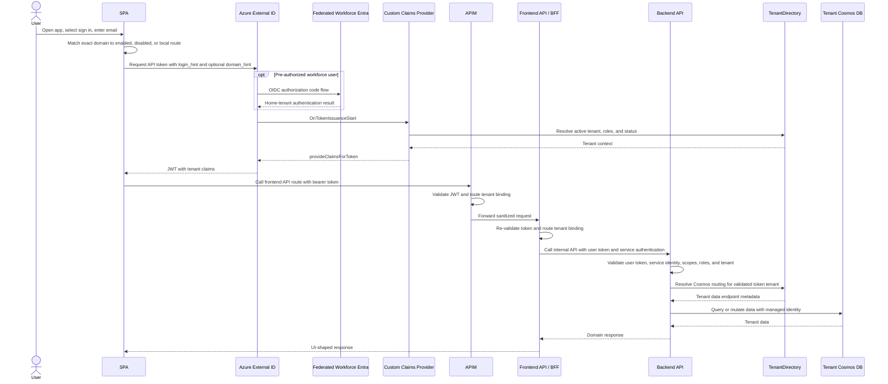

# End-to-End Workflow

Tenant switching requires a new token acquisition flow. The SPA, APIM, frontend API, and backend API must not use `X-Tenant-Id`, query string values, request body values, or other client-controlled fields as tenant authority.

For workforce-federated users, the workforce tenant authenticates the user but External ID remains the application token issuer. Email discovery only selects the authentication journey; it does not authorize access or select a business tenant. Disabled configured domains are blocked before MSAL opens, unknown domains continue to External ID local sign-in, and **Choose another sign-in method** opens the normal provider picker. See `docs/workforce-federation-setup.md`.
